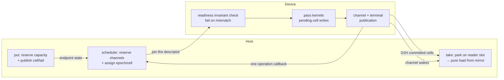

# Runtime–Driver Boundary

> **The boundary is persistent addresses, terminal state, and payload-free
> wakes. It is asymmetric: the device never waits; only the host parks.**

The contract between the Rust **runtime** and the **driver** (embedded
CUDA/Metal linked into `pie-worker`) for PTIR channel programs. The direct-FFI
completion and ownership decisions in [direct_ffi_fix.md](direct_ffi_fix.md)
supersede the older speculative dummy-run design. Steady-state traffic is:

1. **Channel endpoint addresses** (once, at channel registration): one
   driver-local device ring, pinned/shared host mirror, control words, and
   reader/writer wait-id pair per runtime-minted `ChannelId`.
2. **Operation terminal state** (leased per submission): one runtime-owned,
   stable host-visible terminal cell per launch member or value-less operation.
   Cells are recycled only after native retirement; bind returns identity only.
3. **Ordered channel publication**: host puts and accepted device operations
   reserve bounded ring transitions through the scheduler. Committed values and
   head/tail/poison state are published directly through the persistent
   endpoint.
4. **Wakes** (driver → runtime): after persistent state is visible, the driver
   wakes affected channel slots and invokes one payload-free callback for the
   accepted FFI operation.

The value path never travels through the driver: the host reads committed
cells directly from the pinned mirror; host-fed inputs are DMA'd, not
marshaled. The callback carries no value or error payload. Error details are
channel poison; fixed terminal state controls runtime commit or abort.

This realizes the two surviving masterplan contracts (the original
`ptir-plan/` notes are no longer in the tree; §9 restates what this document
depends on):

- **C2**: the scheduler atomically reserves trace-known channel transitions
  before native acceptance. A known-not-ready fire remains queued. The device
  rechecks readiness as an invariant; a post-acceptance miss is terminal
  failure, never a wait, retry, or `Skipped` outcome.
- **C5**: the boundary is persistent addresses, fixed control words, and wakes.

Implementation status is mapped in §7; the migration plan is §8.

---

## 1. Why the boundary is asymmetric

Channels are PTIR's only stateful construct, and their two endpoints have
different blocking semantics:

- **The device never blocks.** Before dispatch, the scheduler's endpoint
  reservation ledger proves that required input occupancy and output capacity
  exist in sequencer order, including transitions projected through earlier
  accepted fires. The device's `k_stage_readiness` check is defense in depth.
  A post-acceptance miss discards pending writes and publishes terminal
  `Failed` plus affected channel poison. It is not normal backpressure and is
  never retried as another outcome of the accepted fire.
- **The host does block.** `take().await` on an empty channel must park a
  future and be woken later. Consequence: the driver → host direction needs
  exactly one primitive, an edge-triggered wake keyed by a ring-index word.

So one direction is a plain store and the other is a single wake. Nothing
else crosses per step.

Typed operations (register program/channel, bind/close instance, close channel,
launch, copy, and resize) are direct, bounded, non-blocking in-proc calls (B1).
They execute only on the per-driver scheduler thread and never hold a lock
across a GPU wait or call a synchronizing device API.

---

## 2. Channel registration and instance bind (B5, bidirectional)

Channel registration establishes endpoint state; bind attaches an instance to
those endpoints and returns its identity. Endpoint addresses and wait ids remain
fixed until the channel is closed (B6).

**driver → runtime: the channel endpoint addresses**

| Base | Memory | Purpose |
|------|--------|---------|
| `ring_base` | device | The endpoint's device ring. Never moves while the channel is live (B6). |
| `mirror_base` | pinned/shared host | The host reads committed cells here as pure loads (B8/B13). |
| `word_base` | pinned/shared host | Producer tail, consumer head, poison, and closed publication words (B9). |

**runtime → driver: the wake targets (B17)**

Each endpoint has one X0 slot-id pair `(reader, writer)`. The runtime allocates
and owns these generation-tagged ids; the driver stores but never inspects them.
They are freed only after ordered native channel close retires.

**runtime → driver: operation terminal state**

Each launch supplies one distinct stable `PieTerminalCell*` per member.
Value-less controls supply one through `PieCompletion`. The driver
release-publishes `Success` or `Failed`; the runtime associates the cell with
the candidate instance epoch and keeps it leased until retirement.

The first attachment freezes endpoint geometry and SPSC claims. Host-visible,
seeded, and non-extern private channels are single-instance. Cross-instance
sharing is valid only for matching unseeded, host-invisible extern declarations
with the same canonical extern binding name, exactly one `Export` producer, and
exactly one `Import` consumer. Bind conflicts reject synchronously before
native mutation.

**The endpoint word layout** (fixed, shared by both sides):

| word index | content | woken slot |
|------------|---------|------------|
| `0` | producer tail / published cell count | reader slot |
| `1` | consumer head / released cell count | writer slot |
| `2` | poison epoch or zero | reader and writer slots |
| `3` | closed flag | reader and writer slots |

After registration and bind, no endpoint layout or channel wake-target
information is exchanged again. Channel wait slots are fixed-capacity. Terminal
cells come from a reusable stable-cell pool, so steady-state retirement recycles
control metadata rather than reallocating it (B15).

---

## 3. Steady state, end to end



1. **put (host)**: reserve bounded endpoint capacity, write the staging cell,
   and release-publish the producer tail. The fire-build enqueues H2D of dirty
   input cells on the copy stream (B16).
2. **fire (scheduler)**: atomically reserve the trace-known channel takes,
   reads, and puts; assign one candidate instance epoch and terminal cell; then
   include the fire in a native batch (B14).
3. **accept (driver)**: validate and prepare the whole batch without durable
   mutation. Synchronous rejection accepts no members. Successful enqueue
   atomically accepts every member and causes exactly one later batch callback.
4. **pass (device)**: recheck readiness and run pass-atomically. An invariant
   miss or execution error publishes no value state and becomes `Failed`.
5. **commit publish (driver)**, stream-ordered after the forward-done event:
   D2H the committed host-visible cells into the pinned mirror, then publish
   new producer tail/consumer head, then release-publish terminal `Success`
   (B11). Failure publishes poison then terminal `Failed`.
6. **wake (driver)**: wake affected endpoint slots, then invoke the one batch
   callback after every member terminal entry is visible. The callback carries
   no result and means only “recheck persistent state” (B17).
7. **take (host)**: the woken future re-polls (register-then-recheck, §6),
   acquire-loads the producer-tail word, reads the cell from the mirror as a pure
   load, and copies once into WASM linear memory at the WIT boundary.
8. **retire (scheduler)**: after the callback, acquire-load each leased terminal
   cell. Commit only `Success` transactions; abort `Failed` transactions and
   their dependent pipeline domains.
9. **close**: detach instances first. Ordered channel close runs after all
   endpoint references retire, marks the endpoint closed, wakes waiters, frees
   native storage, and only then permits runtime wait-slot reclamation (B6).

---

## 4. Locked decisions

**Control plane shape**
- **B1 — Direct calls.** Control verbs are direct, bounded, non-blocking
  in-proc calls on the sole per-driver scheduler. No response frames.
- **B2 — Typed operations.** Program/channel registration, instance/channel
  close, launch, copy, and resize remain separate typed operations.

**Registration & binding**
- **B4 — Register once.** `register_program(trace)` computes the frame
  layout, per-stage kernels, the host-visible channel list, **and bakes the
  trace-static readiness/commit channel lists** once. Nothing per-step
  re-sends state a word already carries.
- **B5 — Endpoint registration, instance attachment.** `register_channel`
  exchanges endpoint addresses and fixed wake ids. Bind attaches channel ids
  and returns instance identity (§2).
- **B6 — Stable storage, ordered close.** Endpoint and terminal addresses never
  move while leased. Instance close detaches after its accepted operations
  retire; channel close follows final detach and frees wait ids only after
  native close.

**Enqueue**
- **B7 — Enqueue is the launch descriptor.** A batch names bound instances
  plus one stable terminal-cell pointer per member. Candidate epochs remain
  scheduler state. The descriptor carries no value or error response storage.
  One `PieCompletion` wakes the operation after every member terminal cell is
  visible.
- **B14 — The per-fire call is the leasing function.** One host call per fire
  remains, because resource leasing (KV pages, batch composition) is
  inherently per-fire host work; this is the dumb-driver division of labor,
  not an inefficiency to eliminate. The target is descriptor **diet**
  (proportional to batch-composition change), not descriptor elimination.

**Reads**
- **B8 / B13 — Direct pinned reads.** The host reads committed cells from the
  pinned mirror as pure loads, never through the driver.

**Completion & wakes (X0)**
- **B9 — Epoch-tagged registration.** A waiter reads the ring word it
  watches and registers `(waker, observed_epoch)`; the committer wakes when
  the word passes it (`wake_past`). The commit-lands-before-park race is
  closed by register-then-recheck (§6).
- **B10 — C++ never holds a `Waker`.** The callback surface receives opaque
  `u64` wait ids, is callable from any thread, and never unwinds. Slots are
  generation-tagged, so a stale id is a harmless no-op; close ordering prevents
  normal callbacks from outliving storage.
- **B11 — Publish before wake, stream-ordered.** The mirror D2H and the word
  publish land in stream order before terminal publication and wake. Runtime
  acquire-loads each leased terminal cell after callback.
- **B12 — Sweep on poison/close/abort.** `sweep` wakes every registered slot
  of the touched channels unconditionally, so a blocked `take().await?`
  re-polls, observes the poison, and resolves to `Err`.

**New in this revision**
- **B15 — Reusable stable control state.** Endpoint wait slots are
  lifetime-stable, and operation terminal cells remain stable while leased and
  are pooled after retirement. An accepted FFI operation invokes exactly one
  payload-free callback; no value/result arena crosses the boundary.
- **B16 — Put and fire are capacity-reserved.** Host puts and scheduler
  dispatch both reserve endpoint capacity. Known-not-ready work remains queued;
  a post-acceptance miss is terminal failure.
- **B17 — The committer wakes what changed.** Channel wake targets live with
  the endpoint. The operation callback wakes the scheduler only after every
  member terminal entry is durable.

> **SPSC ⇒ two fixed slots per host-visible channel** (one reader-waiter, one
> writer-waiter): no waiter lists, no thundering herd, O(1) memory per
> channel.

(B3 was never labeled in the surviving sources and stays retired.)

---

## 5. Key types

```rust
// B5 — runtime-owned identity and wait slots passed at channel registration.
pub struct ChannelEndpointDesc {
    pub channel_id: ChannelId,
    pub shape: Vec<u32>,
    pub dtype: ChannelDType,
    pub capacity: u32,
    pub reader_wait_id: WakerSlotId,
    pub writer_wait_id: WakerSlotId,
}

// B5 — stable driver-owned endpoint allocations returned to the runtime.
pub struct ChannelEndpointBinding {
    pub channel_id: u64,
    pub mirror_base: u64,
    pub word_base: u64,
    pub mirror_bytes: u64,
    pub word_bytes: u64,
    pub cell_bytes: u32,
    pub capacity: u32,
    pub head_word_index: u32,
    pub tail_word_index: u32,
    pub poison_word_index: u32,
    pub closed_word_index: u32,
}

// B5 — bind returns identity; endpoint and terminal storage live elsewhere.
pub struct InstanceBinding {
    pub instance_id: InstanceId,
}

pub struct PieTerminalCell {
    pub outcome: u32, // 0 = pending, 1 = success, 2 = failed
    pub reserved: u32,
}

pub struct PieCompletion {
    pub wait_id: WakerSlotId,
    pub target_epoch: u64,
    // Null for launch; launch members carry their own cells.
    pub terminal_cell: Option<NonNull<PieTerminalCell>>,
}

// D2/B7 — one accepted fire within an atomically accepted native batch.
pub struct LaunchMember {
    pub instance_id: InstanceId,
    pub terminal_cell: NonNull<PieTerminalCell>,
}

pub struct LaunchBatch {
    pub members: Vec<LaunchMember>,
    pub descriptor: LaunchDescriptor,
    pub completion: PieCompletion, // one wake for the whole FFI operation
}

// B1/B2/B4/B14 — conceptual typed direct-ABI surface.
pub enum DriverBackend {
    Dummy(DummyDriver),
    Cuda(CudaDriver),
    Metal(MetalDriver),
}

impl DriverBackend {
    pub fn register_program(&mut self, trace: &[u8]) -> Result<ProgramId>;
    pub fn register_channel(
        &mut self,
        desc: &ChannelEndpointDesc,
    ) -> Result<ChannelEndpointBinding>;
    pub fn bind_instance(&mut self, desc: &InstanceDesc) -> Result<InstanceBinding>;
    pub fn launch(&mut self, batch: &LaunchBatch) -> Result<()>;
    pub fn copy_kv(&mut self, desc: &KvCopyDesc, completion: PieCompletion) -> Result<()>;
    pub fn copy_state(
        &mut self,
        desc: &StateCopyDesc,
        completion: PieCompletion,
    ) -> Result<()>;
    pub fn resize_pool(
        &mut self,
        desc: &PoolResizeDesc,
        completion: PieCompletion,
    ) -> Result<()>;
    pub fn close_instance(&mut self, id: InstanceId) -> Result<()>;
    pub fn close_channel(&mut self, id: ChannelId) -> Result<()>;
}
```

The scheduler owns candidate epochs and terminal-cell leases. A synchronous
`launch` error rejects the entire batch, consumes no candidate epoch, and
causes no callback. A successful return accepts every member. The one
`PieCompletion` callback arrives only after every member terminal cell is
visible; it is a wake to recheck those cells, not proof of success.
For copy, state-copy, and resize, `terminal_cell` is required and remains
stable through callback and retirement. The driver publishes the ordered memory
effect, then release-publishes `Success`; on failure it publishes affected
channel poison, then `Failed`; only then may it invoke the one operation
callback.

---

## 6. Wait and completion protocol: register-then-recheck (B9)

The race between persistent publication and waiter registration is closed
without a lock spanning the boundary:

1. **Fast path.** If the word already passed the target, resolve immediately.
2. **Publish the waker** (`register(slot, waker, observed_epoch)`).
3. **Mandatory re-check.** Re-load the word:
   - passed → deregister and resolve `Ready`;
   - not yet → `Pending` (the committer will see the published waker).

Either the committer sees the published waker, or the re-check sees the
committed index. The SeqCst fence pair inside `register`/`wake_impl` closes
the store-buffering interleaving (loom-found; model-checked in `pie-waker`).
`WaitFuture` / `Completion::poll` encode the protocol so callers cannot get
it wrong. Spurious wakes are permitted everywhere (the futures contract); the
epoch filter keeps them rare, never guarantees their absence.

Operation completion adds one mandatory step: after the payload-free callback,
the scheduler acquire-loads every leased terminal cell. It commits only
`Success` members and aborts `Failed` members. A callback without a terminal
outcome is a protocol violation,
not success.

---

## 7. Implementation status

The terminal-cell, global-endpoint, reservation, ordered-close, and direct
CUDA/Metal model-execution portions of this boundary are implemented. Driver
creation is device-only; the blocking `load_model` boot verb executes the
runtime-compiled `StorageProgram` before any PTIR registration. CUDA typed
copy/resize controls still reject tensor-parallel configurations until an
all-rank control protocol exists. Storage boot details are specified in
[storage-refact-and-metal.md](storage-refact-and-metal.md).

---

## 8. Migration plan

The normative migration order is the five-phase plan in
[direct_ffi_fix.md](direct_ffi_fix.md#5-recommended-fix-order):

1. Atomic acceptance and exact terminal completion.
2. Global channel endpoints, immutable attachments, reservations, and
   same-instance run-ahead.
3. Real single-rank CUDA and Metal execution.
4. Tensor-parallel typed operations and stable sparse/VMM pools.
5. Obsolete-path removal and final validation.

The refactor is complete only after all five phases pass.

---

## 9. Relation to the north star

The masterplan docs are gone; the fragments this design answers to are C2
(scheduler-reserved channel transitions plus device invariant checks), C5
(boundary is persistent addresses plus wakes), §7.3 "channels lower to addresses"
(`channels.hpp`), tier-1 P5.3 (fusion), and the dumb-driver principle (heavy
lifting in PTIR programs; driver stays general; runtime does resource
leasing).

- **Data plane: this spec reaches the star.** put is a store, take is a
  park + pure load, values move by DMA, and per-step boundary traffic is
  words and wakes only.
- **Control plane: the remaining per-fire call is the leasing function.**
  It is north-star-compliant by the dumb-driver division of labor; the
  residual work is descriptor diet, not elimination (B14).
- **Device efficiency: tier-1 fusion is orthogonal and unblocked.** The word
  publish rides the commit bump either way, so fusing readiness/bump into
  stage kernels later changes no part of this contract.

---

## 10. Mock-first (house rule)

Dummy must back the direct ABI with real host allocations for endpoint and
terminal state. Its required test flow is
`register channel → bind → reserve → atomic launch acceptance → publish
terminal state → callback → take → ordered close` without device code or a
second operation queue. CUDA and Metal must satisfy the same tests at their
native boundary.

---

## 11. Source map

| Concern | File |
|---------|------|
| Driver subsystem and typed operations | `runtime/engine/src/driver/` |
| Per-driver ordering and batching | `runtime/engine/src/scheduler/` |
| Completion broker and register-then-recheck | `runtime/engine/src/driver/completion.rs` |
| ABI types and generated C header | `interface/driver/src/local.rs`, `interface/driver/include/pie_driver_abi.h` |
| Host channel API and endpoint state | `runtime/engine/src/pipeline/channel.rs`, `runtime/engine/src/driver/channel.rs` |
| Runtime storage compiler | `runtime/weight-loader/` |
| CUDA direct driver and PTIR channels | `driver/cuda/src/{abi,context}.cpp`, `driver/cuda/src/pipeline/` |
| Metal direct driver | `driver/metal/src/{abi,context}.cpp` |
| Dummy direct driver | `driver/dummy/src/lib.rs` |

---

## Provenance

Rewritten 2026-07-07 from the previous X0-X4 design and amended 2026-07-09
after direct-FFI implementation review. The amendment replaces normal
dummy-run/retry with scheduler reservations plus terminal invariant failure,
moves channel storage and wait ids from instance bind to explicit global
endpoint lifetime, and separates one batch callback from per-member terminal
outcomes. Decision B3 remains unlabeled from the original numbering.
