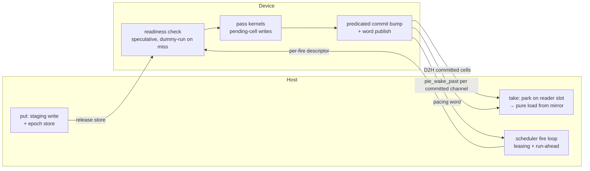

# Runtime–Driver Boundary

> **The boundary is addresses plus wakes, and it is asymmetric: the device
> never waits; only the host parks.**

The contract between the Rust **runtime** and the **driver** (embedded
CUDA/Metal linked into `pie-worker`, or an out-of-proc subprocess) for PTIR
channel programs. After an instance is bound, steady-state traffic is:

1. **Addresses** (once, at bind): a fixed triple of base pointers (device
   frame + pinned host mirror + pinned ring-index words), plus the trace-known
   frame layout.
2. **Epoch stores** (host → driver, per put): a `put` writes the cell and
   release-stores the channel's word. No doorbell, no queue, no wake. The
   device consumer reads whatever is committed at its next fire.
3. **Wakes** (driver → host, per commit): after a fire commits, the driver
   publishes the new ring indices into the pinned words and wakes exactly the
   waiter slots of the channels it committed.

The value path never travels through the driver: the host reads committed
cells directly from the pinned mirror; host-fed inputs are DMA'd, not
marshaled. No heap pointer ever crosses the boundary; the only things that
cross are addresses, ring indices, and opaque `u64` slot ids.

This realizes the two surviving masterplan contracts (the original
`ptir-plan/` notes are no longer in the tree; §9 restates what this document
depends on):

- **C2**: the device reads words at its cut points and proceeds
  speculatively. A readiness miss is a dummy-run retried at the next fire,
  never a wait.
- **C5**: the boundary is addresses plus wakes.

Implementation status is mapped in §7; the migration plan is §8.

---

## 1. Why the boundary is asymmetric

Channels are PTIR's only stateful construct, and their two endpoints have
different blocking semantics:

- **The device never blocks.** A pass's readiness is evaluated on device
  (`k_stage_readiness`) against the freshest channel state (full bits, heads,
  tails, which live in device memory because GPU stages are their primary
  producers and consumers). If an input has not arrived, the pass dummy-runs:
  the predicated commit bump (`k_commit_bump`) publishes nothing, pending
  writes are discarded, and the next fire retries. Rings hold `capacity + 1`
  cells so a writer always has a free slot. Consequence: the host → driver
  direction needs **no signaling at all**. A `put` is a release-store that the
  device observes at its next cut point.

- **The host does block.** `take().await` on an empty channel must park a
  future and be woken later. Consequence: the driver → host direction needs
  exactly one primitive, an edge-triggered wake keyed by a ring-index word.

So one direction is a plain store and the other is a single wake. Nothing
else crosses per step.

Control verbs (register / bind / close / enqueue) are direct, bounded,
non-blocking in-proc calls (B1). A control call is append-to-structure work
that never holds a lock across a GPU wait and never calls a synchronizing
device API. They are deliberately **off** the `DriverChannel` trait (B2): that
trait serves the out-of-proc request/response path; embedded drivers get
direct calls.

---

## 2. The bind contract (B5, bidirectional)

Bind is the one moment the two sides exchange standing state. Both directions
are fixed for the instance's lifetime (B6).

**driver → runtime: the address triple**

| Base | Memory | Purpose |
|------|--------|---------|
| `frame_base` | device | Instance's device frame. Cells live at `frame_base + channel offset + ring index`. Never moves (B6). |
| `mirror_base` | pinned host | The host reads committed cells here as pure loads, never through the driver (B8/B13). |
| `word_base` | pinned host | Ring-index words: pacing plus per-channel head/tail (B9). Layout below. |

**runtime → driver: the wake targets (B17)**

For each host-visible channel `c`, an X0 slot-id pair `(reader, writer)`,
plus one pacing slot per instance. Opaque `u64`s (B10); the driver stores
them in its instance table next to the channel's ring words and never
inspects them.

**The word layout** (fixed, shared by both sides):

| word index | content | woken slot |
|------------|---------|------------|
| `0` | pacing: committed fire count (monotonic) | pacing slot |
| `1 + 2c` | channel `c` committed head (net puts) | reader slot of `c` |
| `2 + 2c` | channel `c` committed tail (net takes) | writer slot of `c` |

After bind, no layout information and no wake-target information is ever
exchanged again. All waker slots are bind-time fixed and freed only at close:
steady state allocates nothing on either side (B15).

---

## 3. Steady state, end to end



1. **put (host)**: write the staging cell, release-store the channel word.
   The fire-build enqueues H2D of dirty input cells on the copy stream. No
   doorbell (B16).
2. **fire (scheduler)**: the batch scheduler (its own OS thread) assembles
   the fire and submits. The per-fire descriptor is the resource-leasing
   decision: KV pages, batch composition (B14).
3. **pass (device)**: readiness checked on device; the pass runs
   pass-atomically; a miss dummy-runs and retries next fire (C2).
4. **commit publish (driver)**, stream-ordered after the forward-done event:
   D2H the committed host-visible cells into the pinned mirror, then publish
   the new head/tail into the pinned words, then bump the pacing word (B11).
   FIFO on the single copy stream keeps every word monotonic by construction.
5. **wake (driver)**: the committer wakes exactly what it committed, reading
   slot ids from its own instance table: `pie_wake_past(reader, head)` /
   `pie_wake_past(writer, tail)` / `pie_wake_past(pacing, fire_seq)`. No
   registry, no channel scan, no rediscovery (B17). The CPU entry point (a
   `cudaLaunchHostFunc` today) does nothing else.
6. **take (host)**: the woken future re-polls (register-then-recheck, §6),
   acquire-loads the head word, reads the cell from the mirror as a pure
   load, and copies once into WASM linear memory at the WIT boundary.
7. **pacing (scheduler)**: run-ahead depth is enforced by awaiting
   `Completion`s: thin waits on `(pacing slot, word[0], target = fire seq)`.
8. **close**: remove the instance from future batches, then free after the
   last in-flight carry retires in FIFO order on the copy stream (one stream
   drain inside the driver). There is no host-side close gate (B6).

---

## 4. Locked decisions

**Control plane shape**
- **B1 — Direct calls.** Control verbs are direct, bounded, non-blocking
  in-proc calls. No submission queue, no response frames for control.
- **B2 — Off the channel trait.** Control verbs are not `DriverChannel`
  obligations; that trait serves the out-of-proc path.

**Registration & binding**
- **B4 — Register once.** `register_program(trace)` computes the frame
  layout, per-stage kernels, the host-visible channel list, **and bakes the
  trace-static readiness/commit channel lists** once. Nothing per-step
  re-sends state a word already carries.
- **B5 — Addresses and wake targets, at bind.** Bind exchanges the address
  triple (up) and the wake slot ids (down). The data plane exchanges no
  layout or wake-target information after bind (§2).
- **B6 — Fixed frame, FIFO-drained close.** The frame address never moves
  while the instance is live. `close_instance` frees only after every
  in-flight carry retires; the single FIFO copy stream enforces this with one
  stream drain inside the driver. No host-side in-flight tracker.

**Enqueue**
- **B7 — Enqueue is the launch descriptor.** A batch names bound instances
  plus opaque descriptor bytes. It carries **no wake context and no
  pointers**: carries fire automatically for every bound instance in the
  batch; wake targets were registered at bind.
- **B14 — The per-fire call is the leasing function.** One host call per fire
  remains, because resource leasing (KV pages, batch composition) is
  inherently per-fire host work; this is the dumb-driver division of labor,
  not an inefficiency to eliminate. The target is descriptor **diet**
  (proportional to batch-composition change), not descriptor elimination.

**Reads**
- **B8 / B13 — Direct pinned reads.** The host reads committed cells from the
  pinned mirror as pure loads, never through the driver.

**Completion & wakes (X0)**
- **B9 — Epoch-tagged registration.** A waiter reads the ring word it
  watches and registers `(waker, observed_epoch)`; the committer wakes when
  the word passes it (`wake_past`). The commit-lands-before-park race is
  closed by register-then-recheck (§6).
- **B10 — C++ never holds a `Waker`.** The FFI surface is `pie_wake` /
  `pie_wake_past`: opaque `u64` in, `0/1` out, callable from any thread,
  never unwinds. Slots are generation-tagged, so a stale id held after close
  is a harmless no-op.
- **B11 — Publish before wake, stream-ordered.** The mirror D2H and the word
  publish land in stream order before the wake fires. End state: the commit
  bump itself stores head/tail into mapped pinned words (device-side
  publish); during migration the carrier's host callback performs the store.
  Monotonicity comes from FIFO order, not from CAS defense.
- **B12 — Sweep on poison/close/abort.** `sweep` wakes every registered slot
  of the touched channels unconditionally, so a blocked `take().await?`
  re-polls, observes the poison, and resolves to `Err`.

**New in this revision**
- **B15 — Zero steady-state allocation.** All waker slots are bind-time
  fixed. No per-batch heap contexts, no exactly-once callback contracts, no
  pointers cross the boundary in either direction.
- **B16 — Put is a store.** Host → driver has no doorbell and no wake. The
  device reads words at its cut points and speculates (C2); `capacity + 1`
  rings and the predicated commit make the retry free of state corruption.
- **B17 — The committer wakes what it committed.** Wake targets live in the
  driver's instance table, registered at bind. There is no completion
  registry, no per-instance channel scan, and no completion-source seam on
  the runtime side.

> **SPSC ⇒ two fixed slots per host-visible channel** (one reader-waiter, one
> writer-waiter): no waiter lists, no thundering herd, O(1) memory per
> channel.

(B3 was never labeled in the surviving sources and stays retired.)

---

## 5. Key types

```rust
// B5 — the bind-time address contract (driver → runtime).
pub struct FrameAddresses {
    pub frame_base:  u64, // device; never moves for the instance lifetime (B6)
    pub mirror_base: u64, // pinned host; direct committed-cell reads (B8/B13)
    pub word_base:   u64, // pinned host; pacing + per-channel head/tail words (§2)
}

// B5/B17 — the bind-time wake targets (runtime → driver). Opaque to the
// driver: it stores the ids next to the ring words and calls pie_wake_past.
pub struct InstanceWakes {
    pub pacing:   WakerSlotId,        // woken past word[0]
    pub channels: Vec<ChannelWakers>, // (reader, writer) per host-visible channel
}

// B7 — the launch descriptor (unchanged; carries no wake context).
pub struct EnqueueBatch {
    pub instance:   InstanceId,
    pub descriptor: Vec<u8>,
}

// B1/B4/B14 — the direct control plane.
pub trait ControlPlane: Send + Sync {
    fn register_program(&self, trace: &[u8]) -> Result<ProgramId>;              // B4
    fn bind_instance(
        &self,
        program: ProgramId,
        bindings: &[u8],
        wakes: &InstanceWakes,                                                  // B5/B17
    ) -> Result<BoundInstance>;
    fn close_instance(&self, id: InstanceId) -> Result<()>;                     // B6
    fn enqueue(&self, batch: EnqueueBatch) -> Result<Completion>;               // B14
}
```

A `Completion` is a thin wait on the instance's **fixed pacing slot** against
`word[0]` with `target = fire seq` (B15: no per-batch slot allocation).
Awaiting it resolves when the driver's commit publish passes that fire.
Dropping a still-pending `Completion` cancels the wait; a later wake on the
fixed slot is filtered by the epoch or, after close, by the generation.

---

## 6. Completion protocol: register-then-recheck (B9)

The race (a commit landing between the waiter's observation and its
registration) is closed without a lock spanning the boundary:

1. **Fast path.** If the word already passed the target, resolve immediately.
2. **Publish the waker** (`register(slot, waker, observed_epoch)`).
3. **Mandatory re-check.** Re-load the word:
   - passed → deregister and resolve `Ready`;
   - not yet → `Pending` (the committer will see the published waker).

Either the committer sees the published waker, or the re-check sees the
committed index. The SeqCst fence pair inside `register`/`wake_impl` closes
the store-buffering interleaving (loom-found; model-checked in `pie-waker`).
`WaitFuture` / `Completion::poll` encode the protocol so callers cannot get
it wrong. Spurious wakes are permitted everywhere (the futures contract); the
epoch filter keeps them rare, never guarantees their absence.

---

## 7. Implementation status

The spec above is the target. What exists today, and its fate:

| Piece | Source | Status / fate |
|-------|--------|---------------|
| X0 waker table + FFI + `WaitFuture` | `runtime/waker/src/lib.rs` (`pie-waker`) | **Built, loom-checked. Keep.** Hygiene split (modules, tests out of lib.rs) in Phase 0. |
| X1 `ControlPlane` + `MockControlPlane` | `runtime/src/driver/control.rs` | **Built. Keep.** `bind_instance` gains `wakes`; `Completion` re-backed by the fixed pacing slot (Phase 1). |
| X2 frame carrier (bind/carry/close, copy stream, forward-event ordering) | `driver/cuda/src/sampling_ir/frame_carrier.{hpp,cpp}` | **Built (mechanism). Keep.** Layout is a 64-byte stub; wake-slot table + direct wakes in Phase 1; real trace layout + device-side word publish in Phase 2. |
| Device channel rings + predicated commit (`k_stage_readiness`, `k_commit_bump`) | `driver/cuda/src/ptir/channels.hpp` | **Built. Keep as-is.** The semantic core (C2, pass-atomicity). |
| X3 completion consumer (registry + scan + `CompletionSource`) | `runtime/src/driver/completion.rs` | Built, **superseded by B17: delete.** Keep `PinnedRingWord` (the word reader). |
| Carry bridge (`CarryDescriptor`, SoA wire cols, `InFlightTracker`, deferred-free/reap) | `runtime/src/driver/carry_bridge.rs` + 4 `ForwardRequest` fields | Built, **superseded by B15/B6/B7: delete**, wire fields included. |
| `CarryWake` + `cuda_carry_done` + `pie_frame_set_carry_done` trampoline | `runtime/src/driver/control_cuda.rs` | **Superseded by B15/B17: delete.** The host callback shrinks to publish + wakes from the driver's own table. |
| `PIE_CARRY_POPULATE` gate | `runtime/src/inference/execute.rs` | Dead flag (enabling it aborts: PTIR arena-instance ids were never `pie_frame_bind`-bound). **Delete**; the bind lifecycle itself becomes the gate. |
| `k_channel_bits` | `driver/cuda/src/ptir/channels.hpp` | Write-only, no consumer. **Delete**; readiness is derivable from the published head/tail words. |
| Tier-0 per-pass host chatter (commit-seed H2D, per-pass list mallocs/uploads, pass-end `cudaStreamSynchronize` + committed D2H + `sync_host_rings`) | `driver/cuda/src/ptir/tier0_runner.hpp` | Works, host-blocking by design (degenerate depth 0). Static lists bake at registration (B4); sync/D2H dissolve into word reads (Phase 2). |
| Host take/read/put | `runtime/src/ptir/ptir_host.rs` | Works via `ForwardResponse` marshal + `finalize_fire` FIFO. Rewired in Phase 2: take parks on the reader slot and loads the mirror; put stores staging + epoch; `finalize_fire` keeps only KV/RS txn settlement. |

Singletons after the rework: one (`WakerTable::global`, the FFI entry).

---

## 8. Migration plan

Each phase merges independently; the system runs between phases.

**Phase 0 — hygiene (no behavior change).** Split `pie-waker` into
`table` / `wait` / `ffi` / `loom` modules with a single sync-shim for the
loom cfg; move tests out of `lib.rs`; trim history commentary to protocol
invariants.

**Phase 1 — remove accidental complexity while the path is dormant.**
- Extend bind: wake slot ids down, word-layout header shared by both sides.
- Carrier callback reduced to word publish + direct `pie_wake_past` calls
  from the driver's instance table.
- Delete: `CarryWake`/`user_ptr` trampoline, carry SoA wire columns,
  `InFlightTracker`/`CloseAction`/reap, `completion.rs` registry/scan,
  `PIE_CARRY_POPULATE`. Port the valuable regression tests (monotonic head,
  close-during-in-flight) to the carrier layer.
- `Completion` re-backed by the fixed pacing slot + `word[0]`.

**Phase 2 — real layout and the value path.**
- Derive the frame layout from the trace (host-visible channel list, cell
  offsets/sizes); per-channel delta D2H replaces whole-frame mirror; bake the
  static readiness/commit lists at registration.
- `k_commit_bump` stores head/tail (and pacing) into mapped pinned words;
  the host callback becomes wake-only; delete `k_channel_bits`, the pass-end
  sync, and the host ring mirrors.
- Rewire `ptir_host`: take/read park on reader slots and load the mirror;
  put writes staging + epoch store (H2D of dirty inputs at fire-build);
  `ForwardResponse` loses the PTIR output marshal.

**Phase 3 — activation and the fire rule.**
- Completion switch: the scheduler paces run-ahead depth on pacing words.
- Fire-skip heuristic (the X4 fire rule, as scheduler policy): skip an
  instance whose input epochs are unchanged since its last dummy-run. Reads
  the same pinned words; no new mechanism.
- Profile; optionally fold wakes into the scheduler's polling loop with a
  single idle doorbell.

**Separate tracks (out of scope here).** Tier-1 fusion (P5.3: readiness into
the first kernel's prologue, bump into the last kernel's epilogue; zero extra
launches). Descriptor diet for B14. Metal/shmem ports: the design carries
over unchanged (the word region lives in shared memory; the doorbell becomes
a futex).

---

## 9. Relation to the north star

The masterplan docs are gone; the fragments this design answers to are C2
(device waits on words at cut points, in `pie-waker`'s header), C5 (boundary
is addresses plus wakes), §7.3 "channels lower to addresses"
(`channels.hpp`), tier-1 P5.3 (fusion), and the dumb-driver principle (heavy
lifting in PTIR programs; driver stays general; runtime does resource
leasing).

- **Data plane: this spec reaches the star.** put is a store, take is a
  park + pure load, values move by DMA, and per-step boundary traffic is
  words and wakes only.
- **Control plane: the remaining per-fire call is the leasing function.**
  It is north-star-compliant by the dumb-driver division of labor; the
  residual work is descriptor diet, not elimination (B14).
- **Device efficiency: tier-1 fusion is orthogonal and unblocked.** The word
  publish rides the commit bump either way, so fusing readiness/bump into
  stage kernels later changes no part of this contract.

---

## 10. Mock-first (house rule)

Each layer proves its shape with a mock before device code exists.
`MockControlPlane` backs the bind contract with host allocations (real,
distinct addresses) and plays the committer by advancing words and waking
slots, so `register → bind → put → fire → take` proves out with zero queue
hops and zero device code. The CUDA carrier is the real-device dual behind
the same `ControlPlane`.

---

## 11. Source map

| Concern | File |
|---------|------|
| Driver subsystem overview | `runtime/src/driver.rs` |
| X0 waker substrate (slots, epochs, FFI, `WaitFuture`) | `runtime/waker/src/lib.rs` (`pie-waker`) |
| X1 direct control plane + mock | `runtime/src/driver/control.rs` |
| X2 CUDA control plane | `runtime/src/driver/control_cuda.rs` |
| CUDA frame carrier (device side) | `driver/cuda/src/sampling_ir/frame_carrier.{hpp,cpp}` |
| Device channel rings + predicated commit | `driver/cuda/src/ptir/channels.hpp` |
| Tier-0 pass runner | `driver/cuda/src/ptir/tier0_runner.hpp` |
| Host channel API (put/take/read hostcalls) | `runtime/src/ptir/ptir_host.rs` |

`runtime/src/driver/completion.rs` and `runtime/src/driver/carry_bridge.rs`
appear in the tree until Phase 1 lands; they are superseded by this spec
(§7) and are not part of the target boundary.

---

## Provenance

Rewritten 2026-07-07 from a design review of the previous X0–X4 shape. The
review found the mechanism sound but the completion side over-built: a
per-batch heap context crossed the wire, a runtime-side registry rediscovered
what the committer already knew, and five host-side mechanisms compensated
for close racing the copy stream. This revision replaces those with the
bind-time wake-target table (B17), zero steady-state allocation (B15), the
no-doorbell put (B16), and FIFO-drained close (B6), and states honestly which
parts are built, dormant, or deleted (§7). Decision B3 remains unlabeled from
the original numbering. The prior revision of this file reconstructed the
spec from module doc-comments after the original `ptir-plan/` notes left the
tree.
