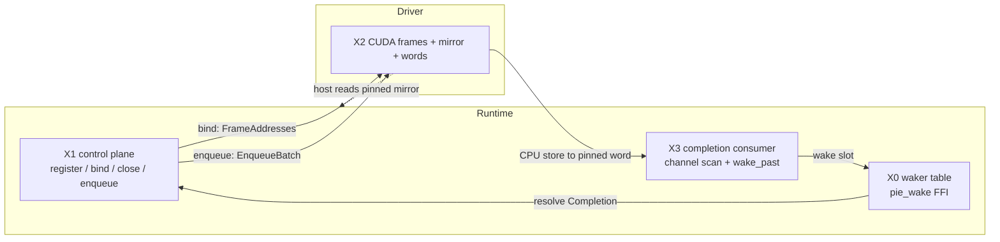

# Runtime–Driver Boundary

> **The boundary is addresses plus wakes.**

The contract between the Rust **runtime** and the **driver** (embedded CUDA/Metal
linked into `pie-worker`, or an out-of-proc subprocess). After an instance is
bound, the two sides exchange only:

1. **Addresses** — a fixed triple of base pointers (device frame + pinned host
   mirror + pinned host ring-index words), plus the trace-known frame layout.
2. **Wakes** — the host parks futures on ring-index words; the driver advances a
   word and wakes the parked slot.

There is **no per-step layout marshaling** and **no response frame on the hot
path**. The value path never travels back through the driver — the host reads
committed cells directly from the pinned mirror.

This is the host-side dual of the masterplan contract **C5**: *the boundary is
addresses plus wakes*.

---

## 1. Why

The hot control plane — program registration, instance bind/close, and per-step
batch enqueue — runs as **direct, bounded, non-blocking in-proc calls**, not as
queue hops with response frames. A control call is append-to-structure work that
never holds a lock across a GPU wait and never calls a synchronizing device API.

Completions are delivered as **edge-triggered waker parks** over a shared
ring-index word, not as messages. This removes the tokio waker round trip and
the per-step request/response encode/decode from the steady-state loop.

---

## 2. Components (X0–X4)

Built **mock-first**: each layer proves its shape with a mock before device code
exists.

| Layer | Role | Source | Decisions |
|-------|------|--------|-----------|
| **X0** | **Tensor-waker substrate.** Rust-owned waker slot table + `pie_wake` FFI. The host parks futures on ring indices; the driver wakes via opaque `u64` slot ids. Leaf crate so the register/commit race is loom-model-checked. | `runtime/waker/src/lib.rs` (`pie-waker`) | B9–B12 |
| **X1** | **Direct control plane.** `register_program` / `bind_instance` / `close_instance` / `enqueue` as direct in-proc calls, **off** the `DriverChannel` trait. Mock-first (`MockControlPlane`). | `runtime/src/driver/control.rs` | B1–B7, B14 |
| **X2** | **CUDA control plane.** The real-device dual of X1's mock: `cudaMalloc` device frame + pinned host mirror/words + the copy-stream carrier. | `runtime/src/driver/control_cuda.rs` | — |
| **X3** | **Completion-wake consumer.** Turns a driver completion into per-channel X0 wakes: scan the committed instance's host-visible channels, read committed head/tail from the pinned words, issue epoch-filtered `wake_past`. | `runtime/src/driver/completion.rs` | B9–B11 |
| **X4** | **Event-driven fire rule.** Builds on X1–X3. | — | — |



---

## 3. The bind-time address contract (B5)

At bind, the driver returns three bases. Combined with the trace-known frame
layout, everything the per-step data plane needs is derived from these — so
after bind **no layout information is exchanged**.

| Base | Memory | Purpose |
|------|--------|---------|
| `frame_base` | device | Instance's device frame. Cells live at `frame_base + channel offset + ring index`. **Never moves** for the instance's lifetime (B6). |
| `mirror_base` | pinned host | The host reads committed cells here — pure loads, never through the driver (B8/B13). |
| `word_base` | pinned host | Ring-index words the host waits on. A waiter registers the index it observed; the driver wakes when the word passes it (B9). |

---

## 4. Locked decisions (B1–B14)

**Control plane shape**
- **B1 — Direct calls.** The control plane is direct, bounded, non-blocking
  in-proc calls. No submission queue, no polling channel, no response frames for
  control.
- **B2 — Off the channel trait.** Control verbs are **not** `DriverChannel`
  trait obligations. That trait serves the observation-shaped out-of-proc path
  (subprocess drivers lower the same semantics to shmem rings + a doorbell);
  embedded drivers get direct-call fast paths.

**Registration & binding**
- **B4 — Register once.** `register_program(trace)` computes the frame layout,
  per-stage kernels, and host-visible channel list once, returning a stable
  `ProgramId`. Nothing per-step re-sends state a word already carries.
  `bind_instance` returns a stable `InstanceId`.
- **B5 — Addresses, not layout.** Bind returns the `FrameAddresses` triple; the
  data plane exchanges no layout after bind (see §3).
- **B6 — Fixed frame for the instance lifetime.** The frame address never moves
  while the instance is live — the precondition for wakers and direct reads.
  `close_instance` returns the regions to their slab only after every in-flight
  pass retires (the §5.2 grace-period discipline).

**Enqueue**
- **B7 — Enqueue is the launch descriptor.** A batch is an `EnqueueBatch`
  naming the bound instance plus opaque descriptor bytes (the real per-fire
  descriptor rebuilds `bases[lane]` + row maps so glue kernels address cells as
  `bases[lane] + offset + index`).
- **B14 — One per-step call.** `enqueue` is the single per-step runtime→driver
  call. It returns a `Completion` the caller parks on.

**Reads**
- **B8 / B13 — Direct pinned reads.** The host reads committed cells from the
  pinned mirror as pure loads, never through the driver.

**Completion & wakes (X0)**
- **B9 — Epoch-tagged registration.** A waiter reads the channel's ring index
  (head or tail) and registers `(waker, observed_epoch)`. The committer wakes
  when the ring index *passes* the registered epoch (`wake_past`). The
  commit-lands-before-park race is closed by the **register-then-recheck**
  protocol (see §6).
- **B10 — C++ never holds a `Waker`.** The FFI surface is `pie_wake` /
  `pie_wake_past`: opaque `u64` in, `0/1` out, callable from any thread, never
  unwinds. All waker memory lives in the Rust table. Slots are
  generation-tagged (`id = generation << 32 | index`), so a stale id held by C++
  after a channel died is a harmless no-op.
- **B11 — Completion is a CPU store.** The driver signals completion with a
  plain CPU store into pinned host memory (advancing the completion word), then
  wakes the slot — not a response frame.
- **B12 — Sweep on poison/close/abort.** `sweep` wakes every registered slot of
  the touched channels unconditionally (ignoring epochs), so a blocked
  `take().await?` re-polls, observes the poison, and resolves to `Err` — it
  never hangs.

> **SPSC ⇒ two fixed slots per host-visible channel** (one reader-waiter, one
> writer-waiter): no waiter lists, no thundering herd, O(1) memory per channel.

---

## 5. Key types

```rust
// X1 — the bind-time address contract (B5).
pub struct FrameAddresses {
    pub frame_base:  u64, // device; never moves for the instance lifetime (B6)
    pub mirror_base: u64, // pinned host; direct committed-cell reads (B8/B13)
    pub word_base:   u64, // pinned host; ring-index words the host waits on (B9)
}

// B7 — the launch descriptor.
pub struct EnqueueBatch {
    pub instance:   InstanceId,
    pub descriptor: Vec<u8>, // opaque: bases[lane] + row maps
}

// B1/B4/B14 — the direct control plane. Embedded drivers implement this;
// the runtime calls it directly, bypassing the request/response transport.
pub trait ControlPlane: Send + Sync {
    fn register_program(&self, trace: &[u8]) -> Result<ProgramId>;                       // B4
    fn bind_instance(&self, program: ProgramId, bindings: &[u8]) -> Result<BoundInstance>; // B4/B5
    fn close_instance(&self, id: InstanceId) -> Result<()>;                              // B6
    fn enqueue(&self, batch: EnqueueBatch) -> Result<Completion>;                        // B14
}
```

A `Completion` is an **epoch-tagged waker park**, not a response frame. Awaiting
it resolves when the driver commits the batch (advances the word + wakes the
slot through X0). The value path never travels through the driver. Dropping a
still-pending `Completion` cancels the wait; the driver's later wake becomes a
generation no-op.

---

## 6. Completion protocol: register-then-recheck (B9)

The race — a commit landing between the waiter's observation and its
registration — is closed without a lock spanning the boundary:

1. **Fast path.** If the word already passed the target, resolve immediately.
2. **Publish the waker** (`register(slot, waker, observed_epoch)`).
3. **Mandatory re-check.** Re-load the word:
   - passed → deregister and resolve `Ready`;
   - not yet → `Pending` (the committer will see the published waker).

Either the committer sees the published waker, or the re-check sees the
committed index. `WaitFuture` / `Completion::poll` encode the protocol so
callers cannot get it wrong; hand-rolled pollers **must** follow it. Spurious
wakes are permitted everywhere (the futures contract); the epoch filter only
keeps them *rare*, never guarantees their absence.

---

## 7. Mock-first (house rule)

Each layer proves its shape with a mock before device code exists.
`MockControlPlane` stands in for the embedded CUDA/Metal driver so the whole
sequence — `register_program → bind_instance → enqueue → completion` — proves
out with **zero queue hops** before any device code. Bind returns the B5 address
triple backed by ordinary host allocations (real, distinct addresses, just not
device); completion is an edge-triggered X0 park — the first real consumer of
the waker substrate. X2 (CUDA frames + mirrors), X3 (completion channel scan),
and X4 (the event-driven fire rule) build on this exact shape.

---

## 8. Source map

| Concern | File |
|---------|------|
| Driver subsystem overview | `runtime/src/driver.rs` |
| X0 waker substrate | `runtime/waker/src/lib.rs` (`pie-waker` crate) |
| X1 direct control plane + mock | `runtime/src/driver/control.rs` |
| X2 CUDA control plane | `runtime/src/driver/control_cuda.rs` |
| X3 completion-wake consumer | `runtime/src/driver/completion.rs` |
| X2/X3 carry-descriptor bridge + in-flight gate | `runtime/src/driver/carry_bridge.rs` |
| CUDA frame carrier (device side) | `driver/cuda/src/sampling_ir/frame_carrier.{hpp,cpp}` |

---

## Provenance

This document reconstructs the Runtime–Driver Boundary specification from the
authoritative module doc-comments in the sources listed in §8 (the original
`ptir-plan/` design note is no longer in the tree). Decision **B3** is not
separately labeled in the surviving source; the numbering above reflects the
decisions currently captured in code.
