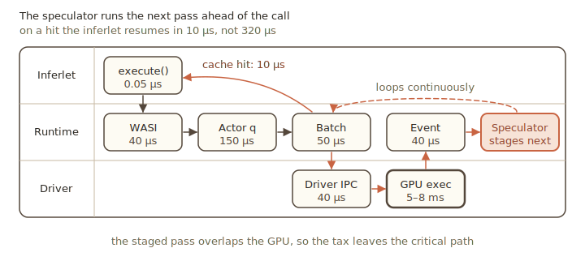

Pie 0.4.0 is out. Two changes lead the release.
Pie's new *speculative execution* hides the runtime's per-token overhead behind GPU compute, effectively removing 90% of the overhead of programmable serving. A new *model-agnostic media API* makes Pie multimodal: images, audio, and video go in, and audio comes out.

In addition to those two, 0.4.0 also features new frontier model support, including GLM 5.1 and Nemotron H, native multi-token-prediction (MTP) support for recent Qwen and Gemma models, as well as KV cache quantization.

{/* truncate */}

## Eliminating the programmability tax with speculative execution

In Pie, every decode step is a forward pass plus the runtime work that wraps it. The forward pass runs 5 to 8ms. The runtime work is far smaller, around 320µs under load, but in a serial schedule it sits between passes as pure latency. That overhead is what we call the [programmability tax](/docs/overview/benchmarks): vLLM and SGLang pay roughly 150µs for a comparable pipeline, and Pie pays an additional 170µs because an inferlet drives generation one call at a time, crossing the WebAssembly boundary and queuing through the inference actor on every token.


In order to mitigate this, Pie 0.4.0 takes advantage of the fact that the next forward pass call is usually highly predictable: just an increment to the KV page offset, position IDs, etc. Pie's new **speculative execution** gets that overhead off the critical path, so the runtime stages the next pass while the GPU is still busy with the current one. When the inferlet makes its real `execute()` call, the staged pass is already running and the result comes back without queuing again. A hit overlaps the runtime work with the previous forward pass; a miss falls back to the normal path. Both produce identical tokens.



It runs by default at depth 1. Raising `speculation_depth` stages a longer chain that also overlaps the inferlet's own WebAssembly time; inferlets need no changes.
```toml
[model.scheduler]
speculation_depth = 4   # 0 disables; default 1 (piggyback)
```

Note that speculative execution is orthogonal to *speculative decoding*, which processes multiple tokens at once, and they can work together.


## Multimodal: images, audio, and video in; audio out

Inferlets can now take images, audio, and video as input and produce audio as output. The media API is model-agnostic: your inferlet hands the host raw bytes (PNG, JPEG, WAV) and the engine runs every model-specific step, from decode to the encoder and delimiters.

Image input is three calls — fetch the bytes, build an `Image`, and splice it into the context:

```rust
let bytes = inferlet::http::fetch(&input.image_url).await?;
let image = Image::from_bytes(&model, &bytes)?;
let mut ctx = Context::new(&model)?;
ctx.append_image(&image).await?;        // encode + commit KV
ctx.user(&input.question).cue();
ctx.generate(sampler).max_tokens(128).collect_text().await
```

Audio input has the same shape (`Audio::from_bytes`, `ctx.append_audio`), and video adds a `max_frames` budget. Audio output is text-to-speech through `model.speak(text)`, which returns a self-describing clip. Vision runs on Qwen3-VL and Gemma-4, audio input on Gemma-4, audio output on CSM. See [Multimodal generation](/docs/guide/model/multimodal).

## Also in 0.4.0

**Native speculative decoding.** Some models ship a multi-token-prediction (MTP) head that drafts several tokens per forward pass; Pie drives it losslessly (Gemma-4, Qwen3.5, Qwen3.5-MoE). Opt in with `.system_speculation()`; off by default. See [Speculative decoding](/docs/guide/forward/speculation).

**Quantization.** Runtime weight quantization (`runtime_quant`) and KV-cache quantization (`kv_cache_dtype`) are operator-side driver options accepting several FP8, INT8, and FP4 formats, so inferlets need no changes. See the [CUDA driver reference](/docs/reference/drivers/cuda).

**Eight model architectures.** `cuda_native` gains GLM-5.1, Nemotron-H, Kimi and DeepSeek (MLA MoE), Qwen3-MoE, Qwen3.5 and 3.6, Qwen3-VL, Gemma-4, and CSM, several with newer attention layouts (MLA, hybrid Mamba/attention, GDN linear attention).

**A faster engine.** The scheduler and weight loader were rewritten, and the CUDA driver now matches or exceeds vLLM throughput on Qwen3.

**TensorRT-LLM driver.** A new experimental driver delegates generation to TensorRT-LLM's `LLM.generate` API, joining vLLM and SGLang for models `cuda_native` does not yet implement.

## Contributors

Thanks to everyone who contributed to 0.4.0: [In Gim](https://github.com/ingim), [Seung-seob Lee](https://github.com/shsym), [Liu Zhiyuan](https://github.com/LIU-ZHIYUAN-source), [Dhruv Dubey](https://github.com/zatchbell1311-wq), [Evan Chan](https://github.com/evanc7007), and [Abraam Mankaruse](https://github.com/agmankaruse).
