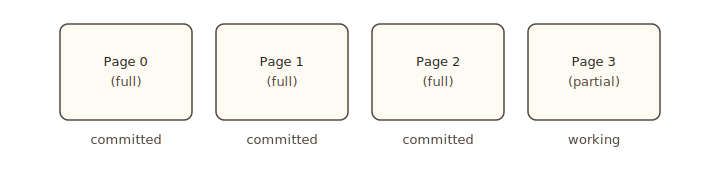

import Tabs from '@theme/Tabs';
import TabItem from '@theme/TabItem';

# Pages

A context's KV cache is a chain of fixed-size pages. Each page holds `page_size` tokens of key/value tensors for every layer of the model. Pages are the unit of memory allocation, the unit of forking, and the unit of prefix caching. This page explains the model. Read this after [Context overview](./overview).

## Why pages

Pre-page implementations of LLM inference allocated KV cache as a single contiguous buffer per request. That made best-of-N copies expensive: you had to allocate a fresh buffer and memcpy the whole prefix.

Pages let you share immutable prefix pages across forks at zero copy cost. The prefix becomes a chain of pages owned by no one in particular; forks add their own pages on top. Allocation is per-page, freeing is per-page, sharing is per-page.

The page size is a model-level constant set when the engine boots. Common values are 16 or 32 tokens per page. You read it from `ctx.page_size()`.

## Committed vs working

A page is in one of two states.



- **Committed** pages are full and immutable. They can be shared across forks and across separate contexts at no cost.
- **Working** pages are mutable. They hold the partial page that's currently being written to. A context has at most a handful of working pages at any moment.

When a working page fills, the engine commits it: the page becomes immutable, gets added to the chain, and any forks that reference this context see the new page on their next access.

## Why commit: content-addressed sharing

Committing makes a page immutable. It also enters the page into the engine's content-addressed cache, where it can be shared with any other context that produces the same prefix. That second effect is what makes Pie's KV cache sharing automatic.

When the engine commits a page, it computes a hash over the tokens that page covers, chained with the hash of the page before it. Two pages produced from the same prefix and the same input tokens hash to the same value, no matter which inferlet or which `Context` produced them.

The engine stores committed pages in a trie keyed by these hashes. On every commit:

- If the hash is already in the trie, the engine bumps the existing page's reference count instead of allocating a new physical page. Two contexts now point to the same page on the GPU.
- When the last reference releases (the contexts that held it are dropped or truncated past it), the physical page returns to the pool.

The dedup is automatic and engine-wide. You do not opt in. Two consequences worth knowing:

- **Forks are O(1) by construction.** `fork()` increments refcounts on the parent's committed pages. The only data that copies is the working page, which has no hash yet.
- **A shared system prompt costs once.** The first request to flush it pays the prefill. Every later request whose context starts with the same tokens hits the trie and reuses the same physical pages. This is what makes [prefix caching](./sharing) cheap.

Working pages stay out of the trie because their content is still being written. Committing is what moves a page into the shareable space.

The runtime implements this with chained hashes, a two-tier GPU/CPU trie, and an eviction policy described in the SOSP paper.

## Prefill, decode, and flush

The act of writing tokens into a context's KV cache is **prefill**. Prefill takes a sequence of new tokens, runs them through the model in parallel, and writes the resulting K/V tensors into pages.

Most code does not call prefill directly. Two paths trigger it:

- **`ctx.generate(...)`** flushes any pending tokens at the start, then runs the autoregressive loop one token at a time.
- **`ctx.forward()`** flushes any pending tokens at the start, then runs the single pass you configured.

If you want to materialize a prefix without generating, call `flush()`:

<Tabs groupId="lang" queryString>
<TabItem value="rust" label="Rust" default>

```rust
ctx.system("Long system prompt with lots of context for the task.");
ctx.user("Question");
ctx.flush().await?;          // commit the prompt; nothing has been generated yet
```

</TabItem>
<TabItem value="python" label="Python">

```python
ctx.system("Long system prompt with lots of context for the task.")
ctx.user("Question")
await ctx.flush()            # commit the prompt; nothing has been generated yet
```

</TabItem>
<TabItem value="js" label="JavaScript">

```typescript
ctx.system('Long system prompt with lots of context for the task.');
ctx.user('Question');
await ctx.flush();           // commit the prompt; nothing has been generated yet
```

</TabItem>
</Tabs>

The reason to do this is **prefix caching**: flush a long shared prompt once, save it as a snapshot, and let many subsequent forks decode from there. See [Forking and saving](./sharing).

## Inspect the layout

Every context exposes counters:

<Tabs groupId="lang" queryString>
<TabItem value="rust" label="Rust" default>

```rust
let total_len = ctx.seq_len();
let psize = ctx.page_size();

// Lower-level counts via the raw handle:
let committed = ctx.inner().committed_page_count();
let working = ctx.inner().working_page_count();
let working_tokens = ctx.inner().working_page_token_count();
```

</TabItem>
<TabItem value="python" label="Python">

```python
total_len = ctx.seq_len
psize = ctx.page_size

# Internal counters (non-public attributes):
committed = ctx._committed_pages
working = ctx._working_pages
working_tokens = ctx._working_tokens
```

</TabItem>
<TabItem value="js" label="JavaScript">

```typescript
const totalLen = ctx.seqLen;
const psize = ctx.pageSize;
```

</TabItem>
</Tabs>

`seq_len` is the total token count: committed pages × page size + tokens in the working page. `page_size` is the model's page size constant.

## Truncate

`ctx.truncate(n)` drops the trailing `n` tokens from the working pages and re-syncs the page counters. This is a rollback primitive: it reaches only into working pages. Committed pages cannot be truncated through this API.

<Tabs groupId="lang" queryString>
<TabItem value="rust" label="Rust" default>

```rust
ctx.truncate(8);     // drop the last 8 tokens from the working page(s)
```

</TabItem>
<TabItem value="python" label="Python">

```python
ctx.truncate(8)      # drop the last 8 tokens from the working page(s)
```

</TabItem>
<TabItem value="js" label="JavaScript">

```typescript
ctx.truncate(8);     // drop the last 8 tokens from the working page(s)
```

</TabItem>
</Tabs>

Use it after a forward pass that wrote speculative draft tokens to roll back the rejected suffix, or after a bad generation step to discard the last few tokens before retrying. Once a page commits, its tokens are out of `truncate`'s reach: snapshot earlier with `fork()` if you need to undo across that boundary.

## Manual page operations

By default, page allocation, commits, and releases happen implicitly. `flush()` reserves pages, runs prefill, and commits the result. `generate()` does the same. Most code never touches page state by hand.

For custom forward-pass loops (sliding windows, attention sink, speculative decoding rollback), Pie exposes the four underlying operations on the raw context handle. They are Rust-only today — the Python and JavaScript SDKs do not surface the inner handle.

```rust
let raw = ctx.inner();

raw.reserve_working_pages(n)?;          // pre-allocate n working pages
raw.commit_working_pages(k)?;           // promote the first k full working pages to committed
raw.release_working_pages(n);           // free n working pages from the tail
raw.truncate_working_page_tokens(n);    // drop the last n tokens within the working pages
```

| Operation | Effect |
|---|---|
| `reserve_working_pages(n)` | Allocate `n` additional working pages so subsequent input does not stall on allocation. |
| `commit_working_pages(k)` | Manually commit `k` full working pages. The committed pages are content-hashed and enter the engine's CAS trie, where they become shareable across forks and across other contexts on the same engine. |
| `release_working_pages(n)` | Drop `n` working pages from the tail. The pages return to the pool. |
| `truncate_working_page_tokens(n)` | Drop the last `n` tokens within the current working pages. The page count does not change. |

`commit_working_pages(k)` is the explicit form of what `flush()` does at the end. You reach for it when you want a fork-friendly snapshot at a specific token boundary, without going through `save()`. The committed pages enter the CAS trie: any other context on the same engine that produces the same prefix will share these same physical pages. The high-level `ctx.truncate(n)` (above) is `truncate_working_page_tokens(n)` with cached counter resync.

Working pages must be full (every slot written) before they can commit. Calling `commit_working_pages(k)` while the k-th page is still partial returns an error. Most code lets `flush()` decide when to commit; the manual form is for hand-written forward-pass loops.

For when to use these operations, see [Tokens, positions, and masks](../forward/inputs).

## When pages get freed

A context's pages release in three situations:

1. **The context drops.** Anonymous contexts release on handle drop. Inside the inferlet, this happens when `ctx` goes out of scope.
2. **The inferlet exits.** Any contexts still alive at exit release their pages, except saved snapshots.
3. **Manual `truncate` or `release_working_pages`.** Working-page tokens or whole working pages release immediately.

Saved contexts (see [Forking and saving](./sharing)) persist past inferlet exit until you `Context::delete` them or the engine restarts.

## Page size and prompt length

Pages cap how finely you can slice a prefix. A 1000-token prompt with `page_size = 16` lives in 62 full pages plus a 8-token working page. If you save this context as a snapshot and fork from it, every fork shares those 62 committed pages and gets its own copy of the working page.

This means the unit of "prefix shared across requests" is page-aligned. Prefixes that end mid-page incur a one-page copy on fork. For best-of-N over a 100-character prompt this is invisible; for prefix caching of a 32K-token system prompt it does not matter either. The pathological case is repeatedly forking after small numbers of new tokens, which forces a working-page copy each time.

## Next

- [Forking and saving](./sharing): copy-on-write branching and named snapshots.
- [Scheduling and budgets](./scheduling): credit accounting, when forward passes get scheduled.
- [The forward pass](../forward/overview): drive a single pass without the generation loop.
