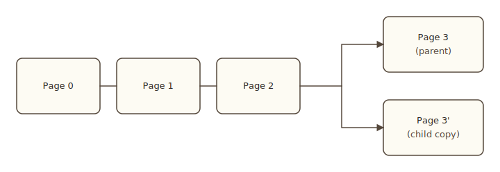
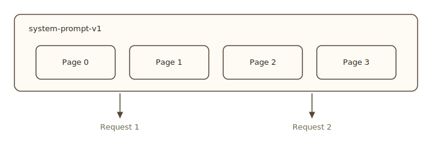

import Tabs from '@theme/Tabs';
import TabItem from '@theme/TabItem';

# Forking and saving

Two operations let you reuse a context's state across branches and across runs: `fork()` clones in O(1), and `save()` snapshots under a name. This page covers both. Read this after [Pages](./pages).

## Fork

`ctx.fork()` is a copy-on-write clone. Committed pages are shared between parent and child; only working pages and any new tokens the child writes cost extra memory.

<Tabs groupId="lang" queryString>
<TabItem value="rust" label="Rust" default>

```rust
let mut child = ctx.fork()?;
child.user("...").cue();
let reply = child.generate(sampler).max_tokens(256).collect_text().await?;
```

</TabItem>
<TabItem value="python" label="Python">

```python
child = ctx.fork()
child.user("...").cue()
reply = await child.generate(sampler, max_tokens=256).collect_text()
```

</TabItem>
<TabItem value="js" label="JavaScript">

```typescript
const child = ctx.fork();
child.user('...').cue();
const reply = await child.generate(sampler, { maxTokens: 256 }).collectText();
```

</TabItem>
</Tabs>



Pages 0, 1, 2 are committed and shared read-only. Page 3' is a fresh copy of the parent's working page; divergent writes go there. The fork is O(1). Memory and compute scale with the divergent tokens, not the prompt length.

Use it for:

- **Best-of-N.** Fork N times from a shared prefix and pick the best output. See the [`best-of-n`](https://github.com/pie-project/pie/tree/main/inferlets/best-of-n) inferlet.
- **Tree of thought.** Explore continuations in parallel and prune low-scoring branches. See the [`tree-of-thought`](https://github.com/pie-project/pie/tree/main/inferlets/tree-of-thought) inferlet.
- **Tool-call retries.** Fork before the call so a failure rolls back cleanly without losing the conversation.
- **Self-critique.** Fork to run a critic against the same prefix without disturbing the original.

## Save and reuse

Naming a context keeps its KV pages alive past the inferlet's exit. Other inferlets, or future runs of the same one, reattach by name. The most common use is **prefix caching**: compute a long shared prompt once, save it, and fork from the saved snapshot for each request.

<Tabs groupId="lang" queryString>
<TabItem value="rust" label="Rust" default>

```rust
// One-time setup: compute and cache the system prompt.
let mut prefix = Context::new(&model)?;
prefix.system("You are a helpful assistant. <long preamble...>");
prefix.flush().await?;
prefix.save("system-prompt-v1")?;

// Per-request:
let prefix = Context::open(&model, "system-prompt-v1")?;
let mut ctx = prefix.fork()?;

ctx.user("New user question").cue();
let resp = ctx.generate(sampler).collect_text().await?;
```

</TabItem>
<TabItem value="python" label="Python">

```python
# One-time setup
prefix = Context(model)
prefix.system("You are a helpful assistant. <long preamble...>")
await prefix.flush()
prefix.save("system-prompt-v1")

# Per-request
prefix = Context.open(model, "system-prompt-v1")
ctx = prefix.fork()
ctx.user("New user question").cue()
resp = await ctx.generate(sampler, max_tokens=256).collect_text()
```

</TabItem>
<TabItem value="js" label="JavaScript">

```typescript
// One-time setup
const prefix = new Context(model);
prefix.system('You are a helpful assistant. <long preamble...>');
await prefix.flush();
prefix.save('system-prompt-v1');

// Per-request
const cached = Context.open(model, 'system-prompt-v1');
const ctx = cached.fork();
ctx.user('New user question').cue();
const resp = await ctx.generate(sampler, { maxTokens: 256 }).collectText();
```

</TabItem>
</Tabs>



`Context::open` clones the snapshot. The snapshot stays. Each request gets its own fork.

## The four operations on snapshots

| Operation | What it does |
|---|---|
| `ctx.save(name)` | Snapshot the current context under `name`. The snapshot is immutable. |
| `Context::open(model, name)` | Open a snapshot. Equivalent to a fork from the snapshot; the snapshot stays. |
| `Context::take(model, name)` | Open a snapshot and remove it from the registry in one step. |
| `Context::delete(model, name)` | Drop a snapshot. |

`take` is useful when you know exactly one inferlet will use the snapshot; it avoids leaving the snapshot lying around. `delete` is the cleanup primitive.

Saved snapshots persist across inferlet runs as long as the engine is up. They do not survive a server restart. For persistent state across restarts, write to the [filesystem](../io/filesystem) or to an external store.

## Persistent named contexts

A second pattern: keep a context alive across many inferlet runs as a *session*. The first run creates and saves; each subsequent run opens, appends a turn, generates, saves again.

<Tabs groupId="lang" queryString>
<TabItem value="rust" label="Rust" default>

```rust
let mut ctx = match Context::open(&model, "session-alice") {
    Some(c) => c,
    None => {
        let mut c = Context::new(&model)?;
        c.system("You are alice's assistant.");
        c.flush().await?;
        c
    }
};

ctx.user(&input.message).cue();
let reply = ctx.generate(sampler).collect_text().await?;

ctx.save("session-alice")?;
```

</TabItem>
<TabItem value="python" label="Python">

```python
ctx = Context.open(model, "session-alice")
if ctx is None:
    ctx = Context(model)
    ctx.system("You are alice's assistant.")
    await ctx.flush()

ctx.user(input["message"]).cue()
reply = await ctx.generate(sampler, max_tokens=256).collect_text()

ctx.save("session-alice")
```

</TabItem>
<TabItem value="js" label="JavaScript">

```typescript
let ctx = Context.open(model, 'session-alice');
if (!ctx) {
    ctx = new Context(model);
    ctx.system("You are alice's assistant.");
    await ctx.flush();
}

ctx.user(input.message).cue();
const reply = await ctx.generate(sampler, { maxTokens: 256 }).collectText();

ctx.save('session-alice');
```

</TabItem>
</Tabs>

The session's KV cache stays warm between runs. The next user turn adds a few hundred tokens of prefill on top of the existing pages instead of re-prefilling the whole conversation.

## When to fork vs. when to save

| Need | Use |
|---|---|
| Branching within a single run | `fork()` |
| Prompt prefix shared across requests | `save()` once, `open().fork()` per request |
| User session that survives across requests | `save()` per turn, `open()` next turn |
| One-shot, no sharing | Neither — just use the context directly |

Forking is free and is the right answer for branching workflows. Saving is for cross-run state.

## Next

- [Scheduling and budgets](./scheduling): the credit auction that prices forward passes.
- [The forward pass](../forward/overview): drop down to single-pass primitives.
- [Examples](../../guide/examples/overview): the [`tree-of-thought`](https://github.com/pie-project/pie/tree/main/inferlets/tree-of-thought) and [`best-of-n`](https://github.com/pie-project/pie/tree/main/inferlets/best-of-n) inferlets are full implementations of fork-and-share workflows.
