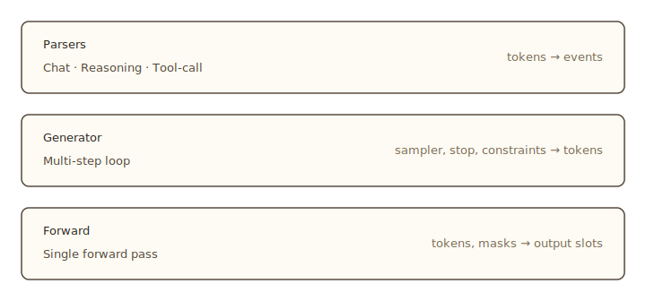

import Tabs from '@theme/Tabs';
import TabItem from '@theme/TabItem';

# Generation: Forward, Generator, parsers

The SDK gives you three abstractions for working with the model. Each one hides a different kind of bookkeeping. Most code uses the highest one. You drop down a layer when you need control the layer above does not expose.

Read this after [Context overview](../context/overview).

## The three layers



What each layer is for:

- **`Forward`** runs the model once. The builder hides the page math: it reserves working pages, derives positions, drains the context's pending buffer, and commits pages after the call returns. You attach samplers and probes; the call returns their results. Detailed in [The forward pass](../forward/overview).
- **`Generator`** runs the model many times under one configuration. You give it a sampler, a stop condition, and any constraints; it loops, samples a token each step, and stops when it should. It calls `Forward` under the hood and handles the per-step bookkeeping (constraint advance, speculation, credit bidding, token counting).
- **Parsers** turn the token stream a `Generator` emits into typed events. The chat parser strips control tokens and emits visible text. The reasoning parser surfaces thinking-block content. The tool-call parser detects calls in the stream. They are stateful stream parsers, not anything to do with sampling.

The SDK calls the three parsers `chat::Decoder`, `reasoning::Decoder`, and `tools::Decoder` because that is the type name in code. In prose, this section calls them parsers — the word "decoder" suggests sampling, which is not what they do.

A typical inferlet uses one or two of these layers. Few need all three.

## Which layer for which job

| Job | Layer |
|---|---|
| "Generate text and return a string." | Generator (`collect_text`). |
| "Stream tokens to a UI as they decode." | Generator + chat parser. |
| "Generate JSON conforming to my type." | Generator (`collect_json::<T>`). |
| "Run the model through a custom decoding loop." | Forward, in a hand-written loop. |
| "Score candidate strings under the model." | Forward + probes. |
| "Watermark sampled tokens." | Generator with the per-step hook. See [Step manually](./generator#step-manually). |
| "Expose the thinking trace separately from the answer." | Generator + chat parser + reasoning parser. |
| "React to the model's tool calls." | Generator + tool-call parser. |

Start with Generator unless you have a reason to drop down. Parsers compose on top of any Generator that produces tokens; they take a `Model` handle so they know the tokenizer and the chat template.

## The same workload, three ways

Top to bottom, the same task at each layer.

### Generator with a collector

The shortest path. `collect_text` drives the Generator until it stops, runs a chat parser internally, and returns the assembled string.

<Tabs groupId="lang" queryString>
<TabItem value="rust" label="Rust" default>

```rust
use inferlet::sample::Sampler;

let text = ctx
    .generate(Sampler::TopP { temperature: 0.6, p: 0.95 })
    .max_tokens(256)
    .collect_text()
    .await?;
```

</TabItem>
<TabItem value="python" label="Python">

```python
from inferlet import Sampler

text = await ctx.generate(
    Sampler.top_p(0.6, 0.95),
    max_tokens=256,
).collect_text()
```

</TabItem>
<TabItem value="js" label="JavaScript">

```typescript
import { Sampler } from 'inferlet';

const text = await ctx.generate(
    Sampler.topP(0.6, 0.95),
    { maxTokens: 256 },
).collectText();
```

</TabItem>
</Tabs>

`collect_text` is one of three collectors on `Generator`. `collect_tokens` returns the raw token IDs. `collect_json::<T>` adds a JSON-schema constraint and parses the result into `T`. All three are Generator-level conveniences; the fact that `collect_text` uses a chat parser inside is an implementation choice, not a constraint on what `collect_text` is for.

### Generator stepped manually, with a parser

When you want streaming text — a UI that updates as tokens arrive — drive the Generator step by step and feed each step's tokens through a parser.

<Tabs groupId="lang" queryString>
<TabItem value="rust" label="Rust" default>

```rust
use inferlet::{chat, sample::Sampler};

let mut g = ctx.generate(Sampler::TopP { temperature: 0.6, p: 0.95 })
    .max_tokens(256);
let mut parser = chat::Decoder::new(&model);

while let Some(step) = g.next()? {
    let out = step.execute().await?;
    match parser.feed(&out.tokens)? {
        chat::Event::Delta(s) => print!("{s}"),
        chat::Event::Done(_)  => break,
        _                      => {}
    }
}
```

</TabItem>
<TabItem value="python" label="Python">

```python
from inferlet import Sampler, chat

g = ctx.generate(Sampler.top_p(0.6, 0.95), max_tokens=256)
parser = chat.Decoder(model)

async for step in g:
    out = await step.execute()
    match parser.feed(out.tokens):
        case chat.Event.Delta(text=t):
            print(t, end="")
        case chat.Event.Done(text=_):
            break
        case _:
            pass
```

</TabItem>
<TabItem value="js" label="JavaScript">

```typescript
import { Sampler, chat } from 'inferlet';

const g = ctx.generate(Sampler.topP(0.6, 0.95), { maxTokens: 256 });
const parser = new chat.Decoder(model);

for await (const step of g) {
    const out = await step.execute();
    const ev = parser.feed(out.tokens);
    if (ev.type === 'delta') process.stdout.write(ev.text);
    else if (ev.type === 'done') break;
}
```

</TabItem>
</Tabs>

The Generator decides what the model does each step. The parser interprets what came out. They are independent: you can use either without the other.

### Forward, in a hand-written loop

When the standard generation loop is the wrong shape (beam search, a custom drafter, scoring candidate strings) you skip Generator and call `ctx.forward()` yourself. The Forward builder still handles page reservation and commits.

```rust
use inferlet::sample::{Sampler, Distribution};

let mut fwd = ctx.forward();
fwd.input(&token_ids);
let h = fwd.sample(&[0], Sampler::Argmax);
let d = fwd.probe(0, Distribution { temperature: 1.0, k: 32 });

let out = fwd.execute().await?;

let token = out.token(h).unwrap();
let (ids, probs) = out.distribution(d).unwrap();
```

See [The forward pass](../forward/overview) for the full Forward surface.

## How the layers compose

Two rules:

1. **`Generator` is built on `Forward`.** The Generator submits one forward pass per step. You rarely see the Forward calls. Drop down to `ctx.forward()` directly only when the Generator's shape is wrong for your workload.
2. **Parsers consume what a Generator emits.** A parser is independent from any Generator: feed it the tokens from each step's `out.tokens` and read its events. Multiple parsers can read the same step's tokens. A parser that has no event for a given step emits `Idle`, which you ignore.

The next pages cover each layer. The [Generator page](./generator) is the API reference for the multi-step loop. The three parser pages ([chat](./chat), [reasoning](./reasoning), [tool-call](./tool-calling)) cover the events each parser emits.

## Next

- [Generator](./generator). The multi-step builder, the three collectors, per-step control.
- [Chat parser](./chat). Visible chat text as a stream of deltas.
- [Reasoning parser](./reasoning). Thinking-block events.
- [Tool-call parser](./tool-calling). Streaming detection of tool calls.
- [The forward pass](../forward/overview). The single-pass primitive Generator runs on top of.
