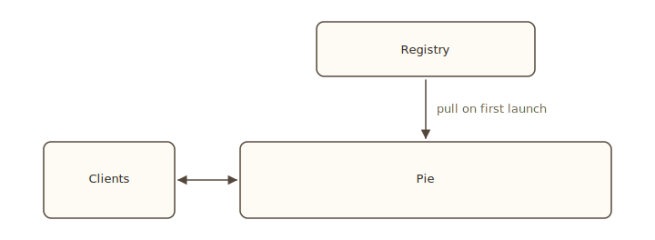

# Deployment overview

A Pie deployment has four moving parts: the engine, your inferlets, a registry, and clients. This page lays out how they fit so the rest of this section makes sense in context. Read this after you have an inferlet that runs locally with `pie run` (see [Tutorial: run](../tutorial/run)).

## The four pieces

- **The engine** (`pie serve`) loads model weights onto GPUs, accepts WebSocket connections, and runs inferlets. One process per host. Long-lived. See [Run a server](./serve).
- **Your inferlets** are WebAssembly components built from Rust, Python, or JavaScript source. The engine instantiates a fresh sandbox per request. See [Build and publish](./build-publish).
- **The registry** stores inferlets by `name@version`. Engines pull on first launch; clients reference inferlets by name. See [Build and publish](./build-publish).
- **Clients** open WebSocket connections, launch processes, and stream events. Three official client libraries: Python, JavaScript, Rust. See [Connecting clients](./clients).

## What changes between dev and prod

The shape of deployment changes along three axes.

### Engine count

- **Single engine, single tenant.** One `pie serve` on a workstation. The default for prototyping.
- **Single engine, multiple users.** One `pie serve` with auth on. Multiple developers connect.
- **Multiple engines.** A pool of engines behind a load balancer. The registry is shared. Each engine runs the same set of inferlets independently. Cross-engine state (saved contexts, messaging) does not propagate.

The engine itself does not coordinate across instances today. For multi-engine deployments, treat each one as independent; route at the client level.

### Inferlet distribution

- **Local builds.** `pie run --path ./out.wasm --manifest ./Pie.toml ...`. The engine reads from disk. Right for tight dev loops.
- **Client-uploaded builds.** A client uploads via the SDK's `add_program` / `install_program`. The engine keeps the upload while it is running. Right for CI deployments and one-off shares.
- **Registry-published builds.** `bakery inferlet publish`. The engine pulls on first launch. Right for shared infrastructure and reproducibility.

The same inferlet runs identically through all three paths; the choice is about how it gets to the engine.

### Auth

- **Off (`--no-auth`).** Anyone who can reach the WebSocket port can launch inferlets. Fine on `127.0.0.1`.
- **On.** Public-key auth with `pie auth add`. Required as soon as the port is reachable from off-host.

If the port is exposed to the network, leave auth on.

## What this section covers

- [Build and publish](./build-publish). The `bakery` toolchain, the registry, and the publishing flow.
- [Run a server](./serve). `pie serve`, monitor mode, dummy backend, graceful shutdown.
- [Connecting clients](./clients). Task-shaped recipes for the three client SDKs.
- [Profiling and benchmarks](./profiling). Measuring inferlet latency and throughput, reading the monitor, running the bench scripts.

## Next

- [Build and publish](./build-publish): get your inferlet to the engine.
- [Run a server](./serve): start the engine.
- [Connecting clients](./clients): call the inferlet from your application.
