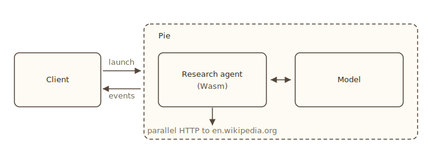

import Tabs from '@theme/Tabs';
import TabItem from '@theme/TabItem';

# Serve and call

The first two pages built the agent and ran it locally with `pie run`. This page runs the engine as a long-lived service and calls the agent from a separate client process over WebSocket. That is the shape a real deployment has: one engine, many clients.

The flow:

1. Start an engine with `pie serve`.
2. Upload the `research-agent.wasm` build to the engine.
3. From a client process, open a WebSocket, launch the inferlet, stream events.

By the end you have a Python, Rust, or JavaScript client that talks to your inferlet. The client can run anywhere: another tab, a separate machine, your application code.

## Start the engine

```bash
pie serve --no-auth
```

```
╭─ Pie Engine ─────────────────────────────────╮
│ Host         127.0.0.1:8080                  │
│ Model        default (Qwen/Qwen3-0.6B)       │
│ Driver       cuda_native                     │
│ Device       cuda:0                          │
╰──────────────────────────────────────────────╯

✓ Server ready at ws://127.0.0.1:8080
```

`--no-auth` is fine for local development. For production, leave it on and authorize clients with public keys; see [Deploy and publish](../deploy/serve#authorize-clients).

The engine accepts WebSocket connections at `ws://127.0.0.1:8080`. It loads the model once, then serves every client from the same loaded weights.

## Install the client SDK

<Tabs groupId="lang" queryString>
<TabItem value="rust" label="Rust" default>

```toml
# In your client project's Cargo.toml
[dependencies]
pie-client = "0.3"
tokio = { version = "1", features = ["full"] }
serde = { version = "1", features = ["derive"] }
serde_json = "1"
anyhow = "1"
```

</TabItem>
<TabItem value="python" label="Python">

```bash
pip install pie-client
```

</TabItem>
<TabItem value="js" label="JavaScript">

```bash
npm install @pie-project/client
```

</TabItem>
</Tabs>

## Upload the build

The engine runs inferlets it has on hand. Two ways to put yours there:

- **Upload the local build** with `add_program` / `install_program`. Quick for development.
- **Publish to a registry** with `bakery inferlet publish`, then `launch_process("name@version", ...)` resolves it. Right for sharing.

The client examples below upload the local build. See [Deploy and publish](../deploy/build-publish) for the registry path.

## Connect, launch, stream

Open a WebSocket, install the build (one-time), launch the inferlet, and read events until it returns.

<Tabs groupId="lang" queryString>
<TabItem value="rust" label="Rust" default>

```rust
use pie_client::{Client, ProcessEvent};
use serde::{Deserialize, Serialize};
use std::path::Path;

#[derive(Serialize)]
struct Input<'a> {
    question: &'a str,
}

#[derive(Deserialize)]
struct Output {
    // The inferlet returns a string from `main`, which arrives as a
    // JSON-encoded string. The client receives it via `ProcessEvent::Return`.
}

#[tokio::main]
async fn main() -> anyhow::Result<()> {
    let client = Client::connect("ws://127.0.0.1:8080").await?;
    client.authenticate("alice", &None).await?;

    // Upload the local build (skip if already present).
    if !client
        .check_program("research-agent@0.1.0", None, None)
        .await?
    {
        client
            .add_program(
                Path::new("./research-agent.wasm"),
                Path::new("./Pie.toml"),
                false,
            )
            .await?;
    }

    // Launch the inferlet.
    let input = serde_json::to_string(&Input {
        question: "Compare the climates of Tokyo, Reykjavik, and Singapore.",
    })?;
    let mut process = client
        .launch_process(
            "research-agent@0.1.0".into(),
            input,
            true,
            None,
        )
        .await?;

    // Read events until the process returns or errors.
    loop {
        match process.recv().await? {
            ProcessEvent::Stdout(s) => print!("{s}"),
            ProcessEvent::Stderr(s) => eprint!("{s}"),
            ProcessEvent::Message(m) => println!("[message] {m}"),
            ProcessEvent::Return(v) => {
                let answer: String = serde_json::from_str(&v)?;
                println!("\n--- ANSWER ---\n{answer}");
                break;
            }
            ProcessEvent::Error(e) => anyhow::bail!("process error: {e}"),
            _ => {}
        }
    }

    client.close().await?;
    Ok(())
}
```

</TabItem>
<TabItem value="python" label="Python">

```python
import asyncio
import json

from pie_client import PieClient, Event


async def main():
    async with PieClient("ws://127.0.0.1:8080") as client:
        # Auth disabled on the server (--no-auth), so pass no key.
        await client.authenticate("alice")

        # Upload the local build (skip if already present).
        if not await client.check_program("research-agent@0.1.0"):
            await client.install_program(
                "./research-agent.wasm",
                "./Pie.toml",
            )

        # Launch the inferlet.
        process = await client.launch_process(
            "research-agent@0.1.0",
            input={
                "question": (
                    "Compare the climates of Tokyo, Reykjavik, and Singapore."
                )
            },
        )

        # Read events until the process returns or errors.
        while True:
            event, value = await process.recv()
            if event == Event.Stdout:
                print(value, end="", flush=True)
            elif event == Event.Stderr:
                print(value, end="", flush=True)
            elif event == Event.Return:
                answer = json.loads(value)
                print(f"\n--- ANSWER ---\n{answer}")
                break
            elif event == Event.Error:
                raise RuntimeError(value)


asyncio.run(main())
```

</TabItem>
<TabItem value="js" label="JavaScript">

```typescript
import { PieClient } from '@pie-project/client';

async function main() {
    const client = new PieClient('ws://127.0.0.1:8080');
    await client.connect();

    // Auth disabled on the server (--no-auth); skip authentication.

    // Upload the local build (skip if already present).
    if (!(await client.checkProgram('research-agent@0.1.0'))) {
        await client.installProgram(
            './research-agent.wasm',
            './Pie.toml',
        );
    }

    // Launch the inferlet.
    const proc = await client.launchProcess('research-agent@0.1.0', {
        question:
            'Compare the climates of Tokyo, Reykjavik, and Singapore.',
    });

    // Read events until the process returns or errors.
    while (true) {
        const { event, value } = await proc.recv();
        if (event === 'stdout') {
            process.stdout.write(value);
        } else if (event === 'stderr') {
            process.stderr.write(value);
        } else if (event === 'return') {
            const answer = JSON.parse(value);
            console.log(`\n--- ANSWER ---\n${answer}`);
            break;
        } else if (event === 'error') {
            throw new Error(value);
        }
    }

    await client.close();
}

main();
```

</TabItem>
</Tabs>

Run the client. The engine instantiates a fresh Wasm sandbox for the inferlet, runs the four steps, and streams events back. Stdout, stderr, and the `Return` event arrive in the same order they are produced. The connection stays open until you close it; you can launch many processes through one connection.

## What you just built



The inferlet is a *service* now. The same uploaded `research-agent@0.1.0` serves every client that connects to this engine. The engine batches forward passes from concurrent processes, so two clients running the agent at the same time share GPU time without either blocking the other.

## Multiple concurrent calls

`launch_process` returns a process handle. Launch several without awaiting and stream them in parallel.

<Tabs groupId="lang" queryString>
<TabItem value="rust" label="Rust" default>

```rust
let questions = [
    "Compare Mars and Venus.",
    "Compare Python and Rust as systems languages.",
    "Compare the climates of Lagos and Cairo.",
];

let mut processes = Vec::new();
for q in questions {
    let input = serde_json::to_string(&Input { question: q })?;
    let p = client
        .launch_process("research-agent@0.1.0".into(), input, true, None)
        .await?;
    processes.push(p);
}

// Drain each in turn (or use tokio::spawn for true concurrent draining).
for mut p in processes {
    loop {
        match p.recv().await? {
            ProcessEvent::Return(v) => {
                let answer: String = serde_json::from_str(&v)?;
                println!("---\n{answer}\n");
                break;
            }
            ProcessEvent::Error(e) => eprintln!("err: {e}"),
            _ => {}
        }
    }
}
```

</TabItem>
<TabItem value="python" label="Python">

```python
import asyncio

questions = [
    "Compare Mars and Venus.",
    "Compare Python and Rust as systems languages.",
    "Compare the climates of Lagos and Cairo.",
]

async def run_one(client, q):
    proc = await client.launch_process(
        "research-agent@0.1.0", input={"question": q}
    )
    while True:
        event, value = await proc.recv()
        if event == Event.Return:
            return json.loads(value)
        if event == Event.Error:
            raise RuntimeError(value)

answers = await asyncio.gather(*(run_one(client, q) for q in questions))
for a in answers:
    print(a, end="\n---\n")
```

</TabItem>
<TabItem value="js" label="JavaScript">

```typescript
const questions = [
    'Compare Mars and Venus.',
    'Compare Python and Rust as systems languages.',
    'Compare the climates of Lagos and Cairo.',
];

async function runOne(client: PieClient, q: string): Promise<string> {
    const proc = await client.launchProcess('research-agent@0.1.0', {
        question: q,
    });
    while (true) {
        const { event, value } = await proc.recv();
        if (event === 'return') return JSON.parse(value);
        if (event === 'error') throw new Error(value);
    }
}

const answers = await Promise.all(questions.map(q => runOne(client, q)));
for (const a of answers) console.log(a, '\n---');
```

</TabItem>
</Tabs>

The engine schedules forward passes across all three concurrent runs together. With Pie's batching, three runs in parallel take roughly the same wall-clock time as one run plus a small per-step overhead.

## Where next

You now have an inferlet that runs locally, an engine you can connect to, and a client you can call it from. The pieces of a deployment are in place. Next steps depend on what you want to do:

- **Share the inferlet.** Publish it to a registry with `bakery inferlet publish`. See [Deploy and publish](../deploy/build-publish).
- **Tighten the agent.** Add a JSON-schema constraint to the planner, handle fetch failures more gracefully, cap the fan-out. See [Structured generation](../forward/constrained).
- **Branch the planner.** Run multiple planners in parallel and pick the one with the most promising titles. See [Branch and share state](../context/sharing).
- **Connect to MCP tools.** Replace the hard-coded Wikipedia fetch with an MCP-registered search tool. See [MCP integration](../io/mcp).
