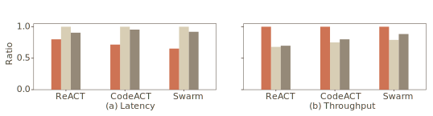
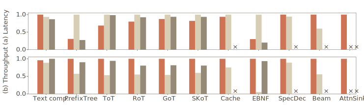

# Benchmarks

This page reports two questions. First, does the inferlet model give you something a black-box endpoint cannot, on a workload where the difference should show? Second, can Pie reproduce the optimizations vLLM and SGLang ship as built-in features without giving up performance? Numbers below.

This page is for engineers comparing Pie to vLLM or SGLang on a specific workload. If you want a qualitative comparison, see [Comparison with other systems](./comparison).

:::note[Reproducibility]
The figures on this page are from the [SOSP '25 paper](https://ingim.org/papers/gim2025pie.pdf), reproduced here for context. The benchmark scripts live in [`benches/`](https://github.com/pie-project/pie/tree/main/benches). Hardware and model are listed under each plot.
:::

## Agent workload: end-to-end latency and throughput

Agentic workflows interleave LLM inference with external I/O — tool calls, code execution, inter-agent messages. With a black-box endpoint, that orchestration runs on the client: every external interaction costs a network round trip, and changing the context can force a re-prefill. Inferlets co-locate the LLM call and the surrounding I/O in a single Wasm runtime on the server, and they keep direct control of the KV cache across interactions.

We compare three representative agent patterns: ReACT (web API calls, 8 I/Os per agent), CodeACT (code execution, 8 I/Os), and Swarm (inter-agent communication, 32 I/Os).

<div style={{textAlign: 'center', marginTop: '1rem', marginBottom: '-1rem'}}>


</div>



*Llama 3 1B (BF16) on an NVIDIA L4 (24 GB). vLLM v0.6.0, SGLang v0.4.4.*

Pie cuts latency by up to 15% and lifts throughput by up to 30% versus vLLM and SGLang. The gain scales with the I/O-to-token ratio: with two or fewer external interactions per agent the curves converge, and the gap widens linearly as the number of interactions grows.

## Replicating existing serving features

The flip side of programmability: does Pie pay a performance tax on the optimizations vLLM and SGLang ship as built-in features? We re-implement eleven techniques as inferlets — basic text completion, prefix caching (Cache, PrefixTree), constrained decoding (EBNF), speculative decoding (SpecDec), beam search (Beam), attention sink (AttnSink), and four prompting strategies (ToT, RoT, GoT, SkoT) — and compare against the systems that ship them natively. The × marks unsupported techniques on a given baseline.

<div style={{textAlign: 'center', marginTop: '1rem', marginBottom: '-1rem'}}>


</div>



*Llama 3 1B (BF16) on an NVIDIA L4 (24 GB). vLLM v0.6.0, SGLang v0.4.4.*

Across the board, Pie matches or beats the native implementations. The point of this plot is the absence of a programmability tax on the workloads vLLM and SGLang are tuned for.

## Programmability tax

The programmability tax is the overhead Pie's machinery adds on a workload where it provides no benefit. We measure it by running plain text completion as a Pie inferlet and as a direct call to vLLM with the same model.

| Model | vLLM TPOT | Pie TPOT | Overhead |
| --- | --- | --- | --- |
| Llama 3 1B | 16.83 ms | 18.75 ms | +1.92 ms (11.4%) |
| Llama 3 3B | 30.30 ms | 32.01 ms | +1.71 ms (5.6%) |
| Llama 3 8B | 64.06 ms | 65.59 ms | +1.53 ms (2.4%) |

The overhead is roughly constant in absolute terms — about 1.5 ms per output token — and shrinks as a fraction of TPOT as the model gets larger. The Wasm runtime itself is negligible (≈1 µs per call); the bulk comes from giving up GPU-side pipelining that vLLM does inside its monolithic decode loop (sampling and input embedding, ≈1.4 ms) plus a small amount of control-layer scheduling. Full breakdown in the [SOSP '25 paper](https://ingim.org/papers/gim2025pie.pdf), §7.4.

## Caveats

- **Single-GPU numbers.** The plots above are on one L4. Multi-GPU and multi-node behavior is a separate topic, covered in the SOSP paper.
- **Small model.** Llama 3 1B is small enough that scheduler and dispatch overhead is most visible. Larger models compress the relative gap (see the table above).
- **Workload mix matters.** On workloads where the request is genuinely a stateless prompt, the inferlet model gives you nothing extra. Use a black-box engine if that is your workload.

## Reproducing

The bench scripts live in [`benches/`](https://github.com/pie-project/pie/tree/main/benches):

```bash
git clone https://github.com/pie-project/pie.git
cd pie
uv sync --extra cu128

uv run python benches/tput.py            # Pie native throughput sweep
uv run python benches/tput_vllm.py       # vLLM, same shape
uv run python benches/tput_sglang.py     # SGLang, same shape
uv run python benches/all_drivers.py     # all three on the same workload
```

Each script writes a CSV next to itself. Hardware and model are configured at the top of the file.

## Next

- [Comparison with other systems](./comparison). Where Pie fits.
- [Drivers](../reference/drivers). Routing to vLLM or SGLang for a side-by-side.
- [Pie: a programmable serving system for emerging LLM applications](https://ingim.org/papers/gim2025pie.pdf). The full evaluation.
