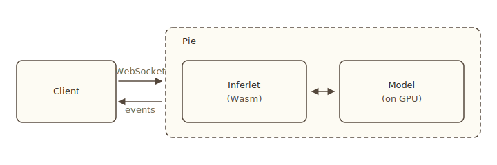

# What is Pie?

Pie is an LLM serving system. A serving system is the software that sits between your inference requests and the model's parameters on a GPU: it loads weights, batches forward passes, manages the KV cache, and exposes an interface to clients. Pie does this with one twist on the conventional model. Instead of accepting prompts and returning tokens through a fixed endpoint, Pie accepts *programs* that the engine runs next to the model. This page explains why that matters.

:::warning[Research prototype]
Pie is a research prototype under active development. APIs and features change without notice.
:::

## Why a new serving system?

Many LLM serving systems exist. [vLLM](https://github.com/vllm-project/vllm), [SGLang](https://github.com/sgl-project/sglang), and [TensorRT-LLM](https://github.com/NVIDIA/TensorRT-LLM) deliver high-throughput batched inference behind a `/completions` endpoint. They treat the model as a black box: the client sends a prompt, the engine returns tokens, and anything richer than that lives in a separate process on the client side.

That model fits chatbots well. It fits agents and nontraditional reasoning workloads poorly. Three problems show up in practice:

1. **KV cache is invisible to the application.** A multi-turn agent redundantly re-prefills its conversation history between tool calls. In multi-agent systems with shared context, KV cache thrashing occurs because the engine is oblivious to KV cache dependencies between agents. The engine must guess the right eviction policy—but it is the application that knows how the cache should be managed.
2. **Tool calls are network round trips.** Agentic systems generate tool requests, send them back to the client, wait for results, then resume inference. Every iteration of the agent loop pays for a round trip.
3. **Custom decoding requires forking the engine.** Speculative decoding, constrained decoding, and custom samplers cannot be expressed through the API. To add one, you patch the serving system itself.

The result is that the interesting workloads of 2026 sit uncomfortably on top of an interface designed for "prompt in, tokens out."

## Serve programs, not prompts

Pie's primitive is the *inferlet*: a small program you write in Rust, Python, or TypeScript that compiles to WebAssembly and runs inside the engine. The inferlet has direct access to the KV cache, the token stream, and the forward pass. The client launches an inferlet by name; the inferlet runs to completion; tokens and events stream back through it.

Here is best-of-N with self-rerank by perplexity, all in one inferlet:

```rust
use futures::future;
use inferlet::{Context, Result, model::Model, runtime, sample::{Sampler, Logits}};
use serde::Deserialize;

#[derive(Deserialize)]
struct Input { prompt: String }

#[inferlet::main]
async fn main(input: Input) -> Result<String> {
    let model = Model::load(runtime::models().first().ok_or("no models")?)?;
    let mut base = Context::new(&model)?;
    base.system("Solve the problem step by step.")
        .user(&input.prompt)
        .cue();
    base.flush().await?;

    // Four chains run concurrently. The engine batches their forward
    // passes, and each pass does double duty: it samples the next token
    // and emits its logits to a probe.
    let base = &base;
    let scored: Vec<(f32, Vec<u32>)> = future::try_join_all((0..4).map(|_| async move {
        let mut ctx = base.fork()?;
        let mut gen = ctx
            .generate(Sampler::TopP { temperature: 0.7, p: 0.95 })
            .max_tokens(256);
        let logits = gen.probe_each_step(0, Logits);

        let mut tokens = Vec::new();
        let mut sum_lp = 0.0f32;
        while let Some(step) = gen.next()? {
            let out = step.execute().await?;
            let token = *out.tokens.first().ok_or("no token")?;
            sum_lp += token_logprob(out.logits(logits).ok_or("no logits")?, token);
            tokens.push(token);
        }
        Result::Ok((sum_lp / tokens.len().max(1) as f32, tokens))
    })).await?;

    let (_, best) = scored.into_iter()
        .max_by(|a, b| a.0.partial_cmp(&b.0).unwrap())
        .ok_or("no candidates")?;
    Ok(model.tokenizer().decode(&best)?)
}

// log_softmax(logits)[t], numerically stable.
fn token_logprob(bytes: &[u8], t: u32) -> f32 {
    let logits: Vec<f32> = bytes.chunks_exact(4)
        .map(|c| f32::from_ne_bytes([c[0], c[1], c[2], c[3]]))
        .collect();
    let m = logits.iter().copied().fold(f32::NEG_INFINITY, f32::max);
    let lse = logits.iter().map(|x| (x - m).exp()).sum::<f32>().ln() + m;
    logits[t as usize] - lse
}
```

`ctx.fork()` is O(1), so the four reasoning branches share the prefix's KV cache through a single copy. They run concurrently: the engine batches forward passes from every active step, so four candidates cost roughly the wall-clock of one. And each pass does double duty; `probe_each_step(0, Logits)` reads the same logits the sampler is about to consume, so the logprob comes for free. A black-box `/completions` endpoint cannot do any of this: prefixes get re-prefilled on every call, samplers don't expose logprobs, and concurrency means coordinating four separate HTTP requests.

The inferlet is just a program. It calls regular library functions to generate tokens, to fork contexts, to issue HTTP requests, to call MCP tools. It runs in a sandbox, so you can run an untrusted one safely. The engine schedules its forward passes alongside every other inferlet's, so the GPU stays busy.

## What this enables

Three classes of workload that are awkward on a black-box endpoint become straightforward inside an inferlet:

- **Branching workflows that share state.** Best-of-N, tree of thought, beam search, speculative reasoning. Each branch is a `fork()`. The KV cache is shared across branches by the engine. You write a loop; the engine handles the cache.
- **Agent loops with no client round trip.** A ReAct agent generates a tool call, calls the tool over WASI HTTP or MCP, appends the result, and continues. The KV cache from the previous step is right there. Tool calls do not cost a network round trip back to the client.
- **Custom decoding without engine changes.** Speculative decoders (Jacobi, n-gram, draft-and-verify), constrained decoding from a grammar or JSON schema, custom samplers, and watermarking are all written as library code on top of the same forward pass primitive. New strategies do not require a fork of the engine.

The [Examples](../guide/examples/overview) page lists the inferlets that ship with the repo. Tree of thought, graph of thought, ReAct, CodeACT, and a handful of speculative decoders are all there as concrete code.

## How the pieces fit



Three pieces:

- **The engine** (`pie serve`) loads models onto GPUs, schedules forward passes, and accepts WebSocket connections.
- **An inferlet** is a sandboxed WebAssembly program that runs inside the engine. You write it in Rust, Python, or TypeScript.
- **A client** connects over WebSocket and asks the engine to launch an inferlet by name.

What happens during a request:

1. The client calls `launch_process("text-completion@0.1.0", {"prompt": "..."})` over the WebSocket.
2. The engine instantiates a fresh Wasm sandbox and runs the inferlet's `main`.
3. The inferlet builds a prompt and calls `ctx.generate(...)`. Each generated token is a forward pass that the engine batches with passes from other live processes.
4. Tokens stream back through the inferlet to the client.

A *process* is one running instance of an inferlet. The engine can host many at once. Forks created inside a process share KV pages copy-on-write. Saved contexts persist across processes.

## Where next

- [Key features](./key-features). What inferlets give you access to: forward pass, KV cache, I/O.
- [Comparison with other systems](./comparison). How Pie relates to vLLM, SGLang, llama.cpp, and HF Transformers.
- [Install and first run](../guide/install). Get Pie running on your machine.

## Further reading

Two papers describe the design and the motivation in depth.

- [Serve Programs, Not Prompts](https://ingim.org/papers/gim2025serve.pdf) (HotOS '25). The vision behind the inferlet abstraction.
- [Pie: a programmable serving system for emerging LLM applications](https://ingim.org/papers/gim2025pie.pdf) (SOSP '25). The design and implementation, with measurements.
